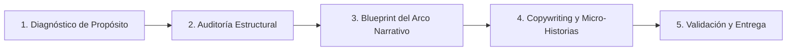

# Web Storytelling & Structural Optimizer

Este skill guía al agente en la auditoría, reestructuración y perfeccionamiento de sitios web para transformar portales estáticos, dispersos o sobrecargados de información en experiencias narrativas profesionales, cautivadoras y alineadas rigurosamente con el propósito del sitio.

---

## 🎯 Cuándo Activar Este Skill

Activa este skill cuando el usuario solicite:
1. **Revisar o auditar la estructura de un sitio web** (home, landing page, observatorio, dashboard o portal institucional/corporativo).
2. **Mejorar el storytelling o la narrativa** de una web para conectar mejor con su audiencia objetivo.
3. **Reestructurar páginas existentes** para que no sean solo "un catálogo de secciones o datos", sino una historia progresiva con propósito.
4. **Optimizar el copywriting y la jerarquía visual** para transmitir valor tangible, autoridad y claridad en segundos.

---

## 🧠 Marco Metodológico: Las 5 Fases de Optimización Narrativa

### Fase 1: Diagnóstico de Propósito y Audiencia (Purpose Discovery)
Antes de modificar cualquier código o texto, define con exactitud la tríada estratégica:
1. **Propósito Medular del Sitio**:
   - *Institucional / Regulatorio / Observatorio*: Rendición de cuentas, democratización de datos, liderazgo técnico, adopción de políticas o normas.
   - *B2B / Consultoría / Servicios*: Generación de confianza, demostración de expertise, captura de leads calificados, cierre comercial.
   - *Producto / SaaS*: Explicación clara del valor, reducción del tiempo al "Aha! moment", activación y conversión.
   - *Comunidad / Impacto*: Empatía, movilización ciudadana, visibilidad de resultados.
2. **Audiencia Clave y Nivel de Sofisticación**:
   - ¿A quién se le habla? (Técnicos, directores de política pública, ciudadanos, inversionistas, clientes operativos).
   - ¿Qué dolor o necesidad inmediata buscan resolver al ingresar?
3. **Selección del Arquetipo Narrativo**:
   - Consulta [Marcos Narrativos](./references/narrative-frameworks.md) para seleccionar entre:
     - **Arco Analítico/Impacto** (*Problema → Revelación de Datos → Insights → Acción Regulatoria/Estratégica*).
     - **StoryBrand / El Héroe es el Usuario** (*Reto del Cliente → Guía Empático con Plan → Demostración → Éxito*).
     - **Problem-Agitation-Resolution (PAR)** (*Fricción real → Consecuencias de no actuar → Solución integrada*).

---

### Fase 2: Auditoría Estructural y de Flujo Escénico (Narrative Audit)
Analiza la estructura actual del sitio evaluando cada sección como si fuera una escena de una película o un capítulo de un libro profesional:

1. **The 5-Second Hero Test (Arranque Inmediato)**:
   - ¿El titular superior comunica el *Qué*, el *Para qué* y el *Beneficio medular* sin jerga vacía?
   - ¿El CTA principal es evidente y consistente con el propósito?
2. **Continuidad y Progresión Escénica (Pacing)**:
   - ¿Existe un hilo conductor entre la sección A y la sección B?
   - *Falla común*: Saltos abruptos (ej. pasar de una frase inspiracional directamente a una tabla densa de 500 filas sin contexto de por qué le importa al lector).
3. **Anclaje Cognitivo de Datos y Evidencia**:
   - En sitios de datos u observatorios: ¿Los datos cuentan una historia (comparativas, evolución temporal, impacto humano/económico) o son simplemente cifras sueltas?
4. **Fricciones y Grasa Informativa**:
   - Detectar bloques repetitivos, menús laberínticos o secciones "muertas" que no aportan al propósito.

> Utiliza la lista de verificación completa en [Checklist de Auditoría](./references/audit-checklist.md).

---

### Fase 3: Arquitectura y Reestructuración Escénica (Narrative Wireframe)
Propón la nueva estructura secuencial de la página, asignando a cada sección un rol narrativo específico:

| Acto Narrativo | Rol de la Sección | Elementos Típicos | Objetivo Psicológico |
| :--- | :--- | :--- | :--- |
| **Acto I: El Gancho** | Captura de atención y promesa de valor | Hero + Indicador clave de impacto + CTA primario | Romper la apatía en <5s y orientar al visitante. |
| **Acto II: El Reto / Contexto** | Definición del problema o estado del sector | El dilema, brechas detectadas, dolores de la industria | Validar que entendemos la realidad del usuario. |
| **Acto III: La Revelación** | La solución, método o motor analítico | Plataforma interactiva, módulos núcleo, enfoque diferencial | Demostrar cómo se resuelve la brecha de forma única. |
| **Acto IV: La Evidencia** | Datos probatorios, casos y validación | Métricas clave, testimonios, visualizaciones de datos, casos de éxito | Generar certeza incuestionable y autoridad técnica. |
| **Acto V: La Acción** | Llamado al siguiente paso | CTA contextual, acceso a datasets/reportes, contacto directo | Facilitar la conversión o adopción sin fricción. |

---

### Fase 4: Copywriting y Micro-Historias en Componentes
Transforma textos planos en frases con pulso y dinamismo:
- **Titulares con Verbo y Valor**: Reemplaza encabezados genéricos como *"Nuestros Servicios"* o *"Datos de Cobertura"* por *"Visualice en tiempo real la evolución de la cobertura y tome decisiones con datos certificados"*.
- **Micro-narrativas en Componentes**:
  - En tablas y tarjetas: añade badges contextuales, subtítulos explicativos del *insight* clave y tooltips que enseñen a interpretar.
  - Consulta [Guía de Copywriting y Micro-narrativas](./references/copy-and-microcopy.md) para fórmulas específicas.

---

### Fase 5: Validación y Presentación de la Propuesta
Al entregar el resultado al usuario:
1. **Presenta un Blueprint Estructurado**: Utiliza la [Plantilla de Blueprint Narrativo](./resources/storytelling-blueprint-template.md).
2. **Muestra el Antes vs. Después**: Explica con claridad la diferencia entre la estructura previa (orientada a contenido estático) y la nueva estructura (orientada a narrativa de valor).
3. **Código / Wireframe Accionable**: Si el usuario lo solicita, genera los cambios directamente en el código fuente (HTML, React, CSS, Markdown, etc.) preservando estilos de alto impacto visual y legibilidad ejecutiva.

---

## 🛠️ Herramientas Complementarias y Sinergia

- Si el sitio requiere renderizado de datos o interfaces visuales, aplica principios de diseño limpio, tipografía moderna, paletas sobrias (azul institucional, pizarra, acentos vibrantes de datos) y micro-interacciones.
- Si el análisis involucra datos regulatorios o métricas especializadas, integra citas a fuentes oficiales y formatos de visualización narrativa (gráficos de barras comparativos, mapas de calor, KPIs tipo velocímetro).
