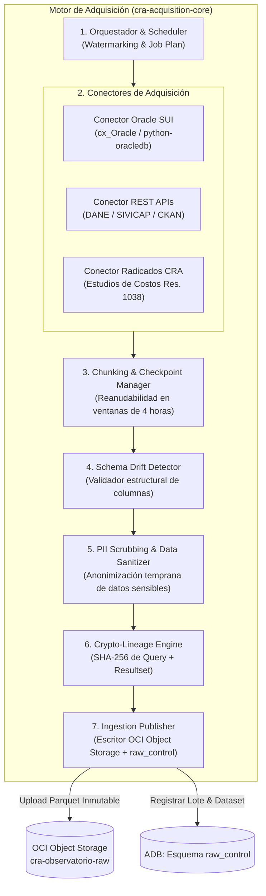

# Arquitectura del Motor de Adquisición de Datos
**Observatorio Regulatorio de Agua Potable y Saneamiento Básico — CRA**  
*Especificación Técnica de Ingesta, Auditoría y Linaje de Fuentes Oficiales*

---

## 1. Visión y Objetivos Estratégicos del Motor

El **Motor de Adquisición de Datos** es la compuerta de entrada primaria y el componente de frontera crítica del Observatorio Regulatorio CRA. Su responsabilidad exclusiva consiste en **extraer, registrar, autenticar y almacenar de forma inmutable los datos de fuentes oficiales** (lideradas por el SUI de la SSPD, DANE, INS-SIVICAP, SIASAR y Radicados CRA), garantizando la reproducibilidad matemática retrospectiva a 10 años sin alterar el dato en su origen ni perturbar los sistemas transaccionales consultados.

```
       FUENTES OFICIALES                       MOTOR DE ADQUISICIÓN                       ZONA CRUDA
┌──────────────────────────────┐        ┌──────────────────────────────────┐        ┌────────────────────┐
│ • SUI (Oracle SSPD)          │        │  [Invocador: Asistido / Daemon]  │        │ OCI Object Storage │
│ • DANE (DIVIPOLA / Proy.)    │───────>│  • Checkpointer & Chunking       │───────>│ Inmutable, WORM,   │
│ • SIVICAP (INS Calidad Agua) │  VPN   │  • Zero-Impact Oracle Runner     │ Parquet│ Particionado       │
│ • Radicados CRA (Res. 1038)  │ /HTTPS │  • PII Masking & Schema Drift    │        └─────────┬──────────┘
│ • SIASAR / IDEAM             │        │  • Crypto-Lineage Engine         │                  │
└──────────────────────────────┘        └──────────────────────────────────┘                  ▼
                                                          │                    ┌─────────────────────┐
                                                          └───────────────────>│ ADB: `raw_control`  │
                                                              Registra Lotes,  │ Checkpoints, Hash,  │
                                                              Eventos y Hash   │ Retransmisiones     │
                                                                               └─────────────────────┘
```

### Principios Rectores de Adquisición
1. **Inmutabilidad Absoluta y Append-Only (`RN-SUI-01`):**  
   Ningún proceso de ingesta actualiza ni borra datos existentes. Las rectificaciones de prestadores generan nuevos snapshots y marcan los anteriores como *superseded*.
2. **Snapshot Propio Desacoplado (`ADR-0006`):**  
   El Observatorio **nunca** calcula indicadores consultando en vivo el SUI. Trabaja siempre sobre sus propios snapshots materializados en OCI Object Storage (`ADR-0007`).
3. **Cripto-Linaje Integral (`RF-SUI-02`):**  
   Dado que no hay archivo original descargado en el SUI, el ancla de linaje es la quintupla: `(hash_sql_ejecutado, timestamp_utc, period_id, row_count, sha256_resultset)`.
4. **Disciplina de Carga Cero-Impacto sobre el SUI:**  
   Prohibidas consultas no acotadas, escaneos de tablas completas sin filtro temporal, o ejecuciones en horarios hábiles de alta concurrencia sobre la base productiva de la SSPD.
5. **Neutralidad de Ejecución (Dualidad Transitoria $\to$ Automatizada, `ADR-0008`):**  
   El motor se compila como un núcleo agnóstico (`cra-acquisition-core`). En la fase actual se dispara mediante una estación operada vía VPN interactiva; en fase definitiva, se dispara por servicio desatendido en la VCN de OCI sin cambiar una sola línea del pipeline de extracción.

---

## 2. Matriz de Fuentes y Estrategia de Conectividad

| Fuente Oficial | Entidad | Mecanismo Físico | Protocolo / Formato | Periodicidad | Modo Operativo |
|---|---|---|---|---|---|
| **SUI Comercial y Operativo** | SSPD | VPN Site-to-Person (Oracle Client) | SQL directo sobre vistas/tablas `CAR_*`, `IUS_*` | Mensual | Asistido por operador (`ADR-0008`) |
| **SUI Financiero y Tarifas** | SSPD | VPN Site-to-Person / Exportación Bulk | SQL / Parquet | Anual / Eventual | Asistido por operador |
| **DIVIPOLA y Proyecciones** | DANE | Catálogo Oficial / API Abierta | HTTPS REST / GeoJSON / CSV | Anual / Decenal | Desatendido (Batch OCI) |
| **SIVICAP (IRCA Calidad Agua)** | INS | Catálogo de Datos Abiertos / Scraping | HTTPS REST / API CKAN | Mensual | Desatendido (Batch OCI) |
| **Radicados Estudios Costos** | CRA | Sede Electrónica / Gestión Documental | Metadatos y PDF/Excel (Formulario Curado) | Quinquenal / Continuo | Asistido (`ADR-0014`) |
| **SIASAR (Rural y Comunitario)**| Banco Mundial / CRA | Exportación estructurada | JSON / API REST | Semestral | Sincronización asistida |

---

## 3. Arquitectura Lógica del Motor de Adquisición

El motor está estructurado en **7 subsistemas modulares**, independientes y coordinados:



### Detalle de Subsistemas

### 3.1 Orquestador y Gestor de Líneas de Agua (Watermarking)
- Administra el calendario de ingesta y las dependencias de fuentes.
- Mantiene los *high-watermarks* de extracción por dominio (`YYYY-MM`).
- Maneja la **ventana de re-extracción periódica** (`RF-SUI-09`):
  - **Mensual:** Periodo corriente $T-1$ y periodo $T-2$.
  - **Trimestral:** Ventana profunda de retransmisión ($T-3$ a $T-12$) para capturar rectificaciones formales de prestadores.

### 3.2 Conectores de Adquisición Adaptativos
- **Oracle SUI Connector:**  
  Usa modo `thin` o `thick` de `oracledb` con TLS. No ejecuta consultas dinámicas libres; únicamente ejecuta **consultas versionadas** almacenadas en el catálogo del motor (`sql_diccionario_fisico_sui`). Realiza lectura mediante *arraysize* balanceado (ej. 5.000 filas por fetch) para no saturar memoria.
- **REST/Catalog Connector:**  
  Descarga metadatos de DANE (DIVIPOLA) y SIVICAP (INS) mediante sesiones HTTP seguras con políticas de reintento exponencial y firmas de cabecera.
- **Radicados CRA Ingestor (`RF-SUI-11`):**  
  Captura asistida para los anexos de la Res. CRA 1038 de 2026 (NMTPP) registrando radicado oficial, usuario cargador (`ACT-CURADOR-DATOS`), metadatos del prestador y hash del documento fuente.

### 3.3 Módulo de Segmentación y Puntos de Control (Chunking & Resumability, `RF-SUI-10`)
Dada la restricción operativa de la VPN site-to-person (desconexión forzosa cada 4 horas):
- La extracción no se ejecuta como una macroconsulta monolítica.
- Se divide en paquetes particionados por `(dominio, servicio, bloque_prestadores, periodo)`.
- El **Checkpointer** almacena el estado de avance en la tabla `raw_control.ingestion_checkpoint`. Si la sesión VPN expira en el prestador #350 de 1.200, la reanudación al siguiente día hábil arranca exactamente en el prestador #351, evitando re-extraer lotes ya asegurados y sin duplicar objetos crudos.

### 3.4 Detector de Variación de Esquema (Schema Drift Detector, `RF-SUI-06`)
- Al recuperar el cursor de una consulta, el motor extrae la firma de metadatos: lista ordenada de columnas, tipos físicos Oracle y nulos.
- Compara la firma contra el `schema_fingerprint` del catálogo de la última ingesta exitosa.
- **Comportamiento ante drift:**
  - Si se añaden, eliminan o renombran columnas en el SUI, **el motor guarda el dataset crudo** para salvaguardar el dato, pero marca el lote como `SCHEMA_DRIFT_DETECTED` y detiene el paso a la zona conformada.
  - Emite alerta prioritaria al Curador de Datos (`ACT-CURADOR-DATOS`) con el diff estructurado.

### 3.5 Filtro de Privacidad y Anonimización Temprana (`RN-SUI-04`)
- Aplica el principio de *privacidad desde el diseño*.
- Campos identificados en el catálogo físico del SUI con clasificación `restringido-propuesto` (cédulas de suscriptores, nombres de personas naturales, prediales o identificadores catastrales individuales en tablas de catastro comercial) son enmascarados o excluidos antes de persistir el Parquet crudo.
- Solo se conservan las llaves regulatorias canónicas: `provider_id`, `service_area_id` y `divipola_code`.

### 3.6 Motor de Cripto-Linaje y Detección de Retransmisiones (`RF-SUI-03`, `RF-SUI-04`)
- Calcula dos huellas criptográficas determinísticas SHA-256:
  1. `query_hash`: SHA-256 del texto canónico normalizado del script SQL ejecutado.
  2. `dataset_sha256`: SHA-256 del conjunto binario de datos exportados.
- **Evaluación de Idempotencia y Retransmisión:**
  - Si el hash coincide con el dataset activo del mismo periodo y dominio $\to$ Registra evento `ingesta_sin_cambios` y no genera carga downstream.
  - Si el hash difiere $\to$ Es una **retransmisión del prestador**. El motor persiste el nuevo snapshot, registra la relación `superseded_dataset_id` en `raw_control.raw_change_log`, y emite el evento para marcar los indicadores asociados en estado `pendiente_recalculo`.

### 3.7 Publicador de Ingesta (Writer OCI)
- Escribe los datos crudos en formato **Apache Parquet comprimido con Snappy/ZSTD**, preservando los tipos nativos y metadatos de esquema.
- Almacena en la jerarquía estándar de buckets de OCI Object Storage.
- Inserta los registros de auditoría correspondientes en el esquema `raw_control` de la Autonomous Database mediante conexión JDBC/Oracle segura.

---

## 4. Topología Física y Estructura en OCI

Conforme a las decisiones `ADR-0004` y `ADR-0007`:

```
OCI TENANCY (CRA)
├── Compartment: `cmp-observatorio-regulatorio`
│   ├── OCI Object Storage: Bucket `cra-observatorio-raw` (Standard Tier con WORM / Retention Rules)
│   │   └── /source={source_id}
│   │       └── /domain={domain_code}
│   │           └── /year={YYYY}
│   │               └── /period={YYYY-MM}
│   │                   └── batch_{batch_id}_{chunk_id}_{sha256:8}.parquet
│   │
│   ├── OCI Autonomous Database (Serverless)
│   │   ├── Esquema `raw_control` (Control de ingesta, lotes, checkpoints, hashes)
│   │   └── Esquema `orchestration` (DAG de eventos de cálculo e ingesta)
│   │
│   └── OCI Vault (Secrets & Key Management)
│       ├── `sui-oracle-credentials` (Sólo en fase desatendida)
│       └── `oci-api-signing-keys`
```

---

## 5. Diseño del Esquema Físico de Control (`raw_control`)

El esquema `raw_control` implementa el siguiente DDL en la Autonomous Database:

```sql
CREATE TABLE raw_control.ingestion_source (
    source_id            VARCHAR2(32) PRIMARY KEY,
    source_name          VARCHAR2(255) NOT NULL,
    connection_mode      VARCHAR2(30) NOT NULL,
    default_cadence      VARCHAR2(20) NOT NULL,
    is_active            NUMBER(1) DEFAULT 1 NOT NULL
);

CREATE TABLE raw_control.ingestion_batch (
    batch_id             VARCHAR2(64) PRIMARY KEY,
    source_id            VARCHAR2(32) NOT NULL,
    execution_mode       VARCHAR2(30) NOT NULL,
    operator_user_id     VARCHAR2(100) NOT NULL,
    started_at           TIMESTAMP WITH TIME ZONE NOT NULL,
    completed_at         TIMESTAMP WITH TIME ZONE,
    batch_status         VARCHAR2(20) NOT NULL,
    total_datasets       NUMBER(8) DEFAULT 0,
    total_records        NUMBER(14) DEFAULT 0,
    error_summary        VARCHAR2(4000),
    FOREIGN KEY (source_id) REFERENCES raw_control.ingestion_source(source_id),
    CONSTRAINT chk_batch_status CHECK (batch_status IN ('RUNNING', 'COMPLETED', 'PARTIAL', 'FAILED'))
);

CREATE TABLE raw_control.ingestion_checkpoint (
    checkpoint_id        NUMBER(14) GENERATED ALWAYS AS IDENTITY PRIMARY KEY,
    batch_id             VARCHAR2(64) NOT NULL,
    domain_name          VARCHAR2(60) NOT NULL,
    reporting_period     VARCHAR2(7) NOT NULL,
    last_provider_id     NUMBER(10),
    chunk_sequence       NUMBER(6) NOT NULL,
    records_in_chunk     NUMBER(10) NOT NULL,
    saved_at             TIMESTAMP WITH TIME ZONE DEFAULT CURRENT_TIMESTAMP NOT NULL,
    is_completed         NUMBER(1) DEFAULT 0 NOT NULL,
    FOREIGN KEY (batch_id) REFERENCES raw_control.ingestion_batch(batch_id)
);

CREATE TABLE raw_control.raw_dataset (
    dataset_id           VARCHAR2(64) PRIMARY KEY,
    batch_id             VARCHAR2(64) NOT NULL,
    source_id            VARCHAR2(32) NOT NULL,
    domain_name          VARCHAR2(60) NOT NULL,
    reporting_period     VARCHAR2(7) NOT NULL,
    query_id             VARCHAR2(64) NOT NULL,
    query_text_sha256    VARCHAR2(64) NOT NULL,
    schema_fingerprint   VARCHAR2(64) NOT NULL,
    object_storage_uri   VARCHAR2(1000) NOT NULL,
    file_sha256          VARCHAR2(64) NOT NULL,
    record_count         NUMBER(12) NOT NULL,
    byte_size            NUMBER(14) NOT NULL,
    ingested_at          TIMESTAMP WITH TIME ZONE DEFAULT CURRENT_TIMESTAMP NOT NULL,
    is_superseded        NUMBER(1) DEFAULT 0 NOT NULL,
    FOREIGN KEY (batch_id) REFERENCES raw_control.ingestion_batch(batch_id),
    FOREIGN KEY (source_id) REFERENCES raw_control.ingestion_source(source_id)
);

CREATE TABLE raw_control.raw_change_log (
    change_id            VARCHAR2(64) PRIMARY KEY,
    new_dataset_id       VARCHAR2(64) NOT NULL,
    superseded_dataset_id VARCHAR2(64) NOT NULL,
    domain_name          VARCHAR2(60) NOT NULL,
    reporting_period     VARCHAR2(7) NOT NULL,
    detected_action      VARCHAR2(30) NOT NULL,
    records_diff         NUMBER(10),
    detected_at          TIMESTAMP WITH TIME ZONE DEFAULT CURRENT_TIMESTAMP NOT NULL,
    recalculation_status VARCHAR2(20) DEFAULT 'PENDING' NOT NULL,
    FOREIGN KEY (new_dataset_id) REFERENCES raw_control.raw_dataset(dataset_id),
    FOREIGN KEY (superseded_dataset_id) REFERENCES raw_control.raw_dataset(dataset_id)
);
```

---

## 6. Disciplina de Carga sobre el SUI (SSPD)

1. **Prohibición de `SELECT *` y Consultas Ad Hoc:** Todas las consultas son precompiladas y versionadas.
2. **Filtrado Obligatorio por Claves de Partición:** Toda consulta incorpora filtros `PERIODO = :period_id` o `ID_FORMATO = :form_id`.
3. **Paginación / Arraysize:** Uso de `arraysize = 5000` en el conector Oracle para evitar saturación de memoria en la estación.
4. **Ventana Horaria de Extracción:** Ejecución en horas no pico institucionales (después de las 17:00 o antes de las 08:00 h).
5. **Circuit Breaker y Backoff Exponencial (`RF-SUI-05`):** 3 reintentos con espera exponencial ante caídas antes de suspender y notificar al curador.
