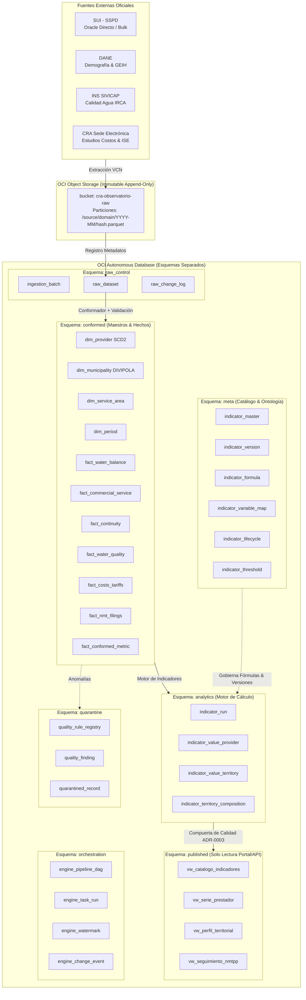
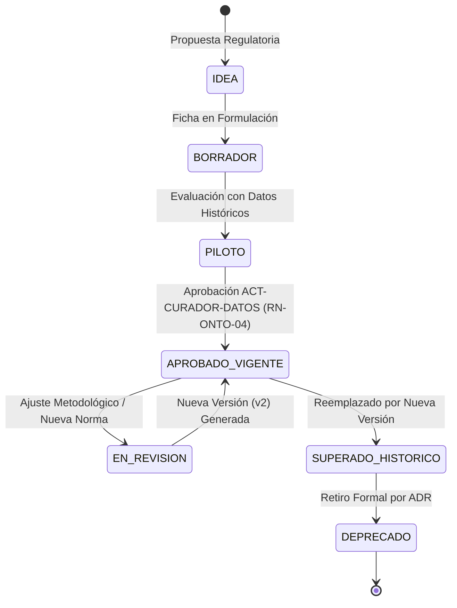
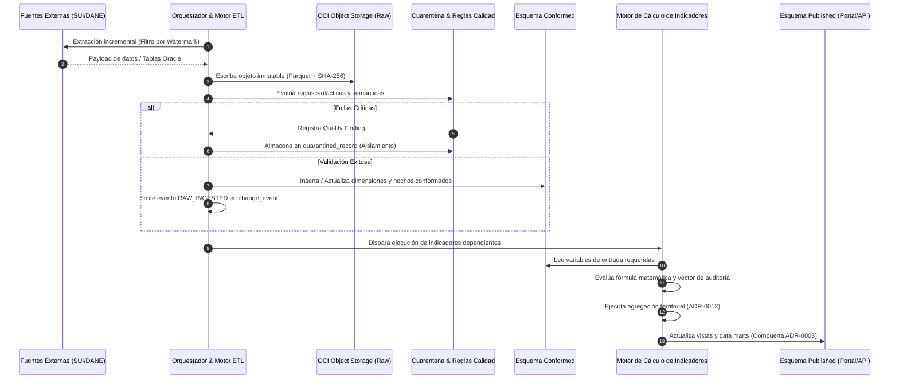

# Modelo de Datos Integral del Observatorio Regulatorio CRA

**Documento:** Especificación del Modelo Lógico y Físico de Datos  
**Proyecto:** Observatorio Regulatorio CRA (Comisión de Regulación de Agua Potable y Saneamiento Básico)  
**Versión:** 1.0.0  
**Fecha:** 2026-09-28  
**Estado:** Propuesta Técnica y Arquitectura de Referencia  
**Autores:** Equipo de Arquitectura de Datos & Inteligencia Regulatoria  

---

## 1. Visión y Principios de Diseño

El presente documento define y documenta el **Modelo de Datos Integral del Observatorio Regulatorio CRA**, diseñado para soportar la totalidad de la batería de indicadores contemplada:
1. **Catálogo General V1 (14 indicadores)** en 10 dimensiones sectoriales (COB, CON, CAL, PER, EFI, FIN, INV, ASE, CLI, ECI).
2. **Catálogo Especializado NMTPP - Res. CRA 1038 de 2026 (25 indicadores)** para el seguimiento integral de pequeños prestadores en 6 capas funcionales (Adopción, Nivel de Servicio S1/S2, Régimen Especial, Transversal, Eficiencia e Incentivos, y Tarifa), más 9 candidatos reservados.
3. **Catálogo de Grandes Prestadores NMT - Res. CRA 1032 / 943 (8 indicadores)**.

### Principios Rectores No Negociables

1. **Modularidad Basada en Metadatos (Metadata-Driven Engine):**
   Un nuevo indicador no requiere alterar la estructura DDL de la base de datos ni reprogramar pipelines de extracción. Se registra en el catálogo de metadatos, se le asigna su versión metodológica, su fórmula parametrizada, el mapeo de variables de entrada y su regla de agregación territorial.
2. **Ciclo de Vida Desacoplado:**
   Cada indicador evoluciona de forma independiente en su ciclo de vida (`IDEA` $\to$ `BORRADOR` $\to$ `PILOTO` $\to$ `APROBADO_VIGENTE` $\to$ `EN_REVISION` $\to$ `SUPERADO` $\to$ `DEPRECADO`), permitiendo adiciones y ajustes metodológicos graduales.
3. **Inmutabilidad y Linaje Matemático de Extremo a Extremo:**
   Ningún dato en la zona cruda se sobrescribe o transforma destructivamente. Todo valor publicado (`indicator_value`) posee trazabilidad determinística hasta la versión exacta de la fórmula, el vector de variables evaluadas, los registros conformados y el hash SHA-256 del archivo/consulta en la fuente oficial (`RF-ONTO-08`, `RN-SUI-01`).
4. **Bitemporalidad Estricta:**
   Separación absoluta entre el **periodo de reporte de negocio** (`period_id`, ej. 2026-08) y el **tiempo del sistema / ingesta** (`ingestion_ts`, `calculation_ts`). Una retransmisión del prestador no muta el pasado silenciosamente: genera una nueva versión del dato y superseded la previa.
5. **Agregación Territorial Transparente con Descomposición Visible:**
   Ningún valor territorial (municipal, departamental o nacional) se publica como un promedio plano ciego (`ADR-0012`, `RF-ONTO-09`). Se calcula conforme a la función canónica de la ficha (cociente de sumas o media ponderada), se condiciona a un umbral de cobertura de reporte (mínimo 80% de suscriptores facturados) y se acompaña de la lista completa de prestadores con su peso y estado.
6. **Segregación de Ambientes y Compuerta de Calidad:**
   Separación física y lógica de zonas (`raw`, `conformed`, `quarantine`, `analytics`, `published`). El portal y las APIs públicas únicamente tienen permisos de lectura en la zona `published`. Ningún dato en cuarentena o sin ficha aprobada puede ser expuesto al público (`ADR-0003`, `ADR-0007`).

---

## 2. Arquitectura de Zonas de Datos (Topología OCI)

Conforme a lo ratificado en `ADR-0004` y `ADR-0007`, la topología física aprovecha el almacenamiento escalable de bajo costo en **OCI Object Storage** para la retención inmutable a 10 años de la zona cruda, y la **Autonomous Database (ADB)** en esquemas separados por privilegios estrictos:



---

## 3. Diccionario de Datos y Modelo Entidad-Relación por Esquema

### 3.1 Esquema `meta`: Catálogo de Indicadores, Ontología y Fichas Metodológicas

Contiene la parametrización de la batería completa y su ciclo de vida. Permite crear nuevos indicadores o ajustar metodologías sin DDL.

#### Tabla: `meta.indicator_master`
Identidad canónica del indicador en el Observatorio.
```sql
CREATE TABLE meta.indicator_master (
    indicator_code       VARCHAR2(32) PRIMARY KEY,     -- Ej: 'IND-PER-01', 'NMTPP-S1-CON'
    canonical_name       VARCHAR2(255) NOT NULL,    -- Nombre coherente con docs/glosario.md
    dimension_code       VARCHAR2(10) NOT NULL,     -- 'COB','CON','CAL','PER','EFI','FIN','INV','ASE','CLI','ECI','SEG'
    service_code         VARCHAR2(10) NOT NULL,     -- 'ACU','ALC','ASE','AAA','AA'
    family_code          VARCHAR2(20) NOT NULL,     -- 'GENERAL_V1', 'NMTPP_1038', 'NMT_1032'
    is_active            NUMBER(1) DEFAULT 1 NOT NULL,
    created_at           TIMESTAMP WITH TIME ZONE DEFAULT CURRENT_TIMESTAMP NOT NULL,
    CONSTRAINT chk_dim CHECK (dimension_code IN ('COB','CON','CAL','PER','EFI','FIN','INV','ASE','CLI','ECI','SEG')),
    CONSTRAINT chk_fam CHECK (family_code IN ('GENERAL_V1', 'NMTPP_1038', 'NMT_1032'))
);
```

#### Tabla: `meta.indicator_version`
Almacena cada versión metodológica aprobada o en formulación de la ficha técnica (`RF-ONTO-02`, `RF-ONTO-04`).
```sql
CREATE TABLE meta.indicator_version (
    indicator_code           VARCHAR2(32) NOT NULL,
    version_num              NUMBER(4) NOT NULL,
    lifecycle_state          VARCHAR2(30) NOT NULL,   -- 'BORRADOR','PILOTO','APROBADA','SUPERADA','DEPRECADA'
    valid_from_period        VARCHAR2(7) NOT NULL,    -- Periodo inicio de vigencia: 'YYYY-MM'
    valid_to_period          VARCHAR2(7),             -- Null si es la actual vigente
    natural_definition       CLOB NOT NULL,           -- Definición en lenguaje ciudadano (campo 4 ficha)
    canonical_unit           VARCHAR2(30) NOT NULL,   -- 'm3','l/s','$/m3','COP','horas/dia','pct','suscriptores'
    monetary_base_year       NUMBER(4),               -- Obligatorio si la unidad es COP o $/m3 (RF-ONTO-07)
    monetary_condition       VARCHAR2(15),            -- 'CORRIENTE' o 'CONSTANTE'
    periodicity              VARCHAR2(20) NOT NULL,   -- 'MENSUAL', 'TRIMESTRAL', 'ANUAL', 'EVENTUAL'
    normative_basis          VARCHAR2(500) NOT NULL,  -- Norma, año, artículo o 'Construcción metodológica CRA'
    interpretation_limits    CLOB NOT NULL,           -- Limitaciones de interpretación (campo 12)
    aggregation_function     VARCHAR2(50) NOT NULL,   -- 'COCIENTE_SUMAS', 'MEDIA_POND_SUSCRIPTORES', 'MEDIA_POND_M3', 'POND_POBLACION_RIESGO', 'SUMA', 'NO_AGREGABLE'
    min_reporting_coverage   NUMBER(5,2) DEFAULT 80.00 NOT NULL, -- Umbral mínimo cobertura reporte (ADR-0012)
    curator_user_id          VARCHAR2(100),           -- ACT-CURADOR-DATOS que aprueba (RN-ONTO-04)
    approval_date            DATE,
    adr_reference            VARCHAR2(50),            -- Ej: 'ADR-0012', 'ADR-0013'
    PRIMARY KEY (indicator_code, version_num),
    FOREIGN KEY (indicator_code) REFERENCES meta.indicator_master(indicator_code),
    CONSTRAINT chk_unit CHECK (canonical_unit IN ('m3','l/s','$/m3','COP','horas/dia','pct','suscriptores','adimensional')),
    CONSTRAINT chk_monetary CHECK (
        (canonical_unit NOT IN ('$/m3','COP')) OR 
        (canonical_unit IN ('$/m3','COP') AND monetary_base_year IS NOT NULL AND monetary_condition IS NOT NULL)
    ),
    CONSTRAINT chk_agg_fn CHECK (aggregation_function IN (
        'COCIENTE_SUMAS', 'MEDIA_POND_SUSCRIPTORES', 'MEDIA_POND_M3', 
        'POND_POBLACION_RIESGO', 'SUMA', 'NO_AGREGABLE'
    ))
);
```

#### Tabla: `meta.indicator_formula`
Contiene la especificación ejecutable de la fórmula matemática para el motor de cómputo.
```sql
CREATE TABLE meta.indicator_formula (
    indicator_code       VARCHAR2(32) NOT NULL,
    version_num          NUMBER(4) NOT NULL,
    formula_expression   VARCHAR2(2000) NOT NULL, -- Expresión simbólica: '((VAP - VFACT) / VAP) * 100'
    engine_type          VARCHAR2(30) DEFAULT 'SQL_AST' NOT NULL, -- 'SQL_AST', 'DUCKDB', 'PYTHON_EXPR'
    compiled_expression  CLOB,                    -- Sentencia o AST compilado
    execution_order      NUMBER(4) DEFAULT 1,     -- Orden de precedencia si depende de otros indicadores
    PRIMARY KEY (indicator_code, version_num),
    FOREIGN KEY (indicator_code, version_num) REFERENCES meta.indicator_version(indicator_code, version_num)
);
```

#### Tabla: `meta.indicator_variable_map`
Descompone las variables de entrada del indicador para garantizar linaje estricto celda-fuente.
```sql
CREATE TABLE meta.indicator_variable_map (
    indicator_code       VARCHAR2(32) NOT NULL,
    version_num          NUMBER(4) NOT NULL,
    variable_code        VARCHAR2(32) NOT NULL,   -- Ej: 'VAP', 'VFACT', 'HORAS_INTERRUPCION'
    variable_name        VARCHAR2(255) NOT NULL,
    variable_role        VARCHAR2(20) NOT NULL,   -- 'NUMERADOR', 'DENOMINADOR', 'FACTOR_AJUSTE', 'FILTRO'
    source_type          VARCHAR2(30) NOT NULL,   -- 'CONFORMED_FACT', 'DANE_API', 'SIVICAP_TABLE', 'MANUAL_CRA'
    source_table         VARCHAR2(60) NOT NULL,   -- Ej: 'conformed.fact_water_balance'
    source_column        VARCHAR2(60) NOT NULL,   -- Ej: 'water_produced_m3'
    unit_of_measure      VARCHAR2(30) NOT NULL,
    is_required          NUMBER(1) DEFAULT 1 NOT NULL,
    PRIMARY KEY (indicator_code, version_num, variable_code),
    FOREIGN KEY (indicator_code, version_num) REFERENCES meta.indicator_version(indicator_code, version_num)
);
```

#### Tabla: `meta.indicator_threshold`
Umbrales normativos, bandas de alerta y rangos teóricos válidos.
```sql
CREATE TABLE meta.indicator_threshold (
    indicator_code       VARCHAR2(32) NOT NULL,
    version_num          NUMBER(4) NOT NULL,
    segment_code         VARCHAR2(20) DEFAULT 'ALL' NOT NULL, -- 'ALL', 'S1', 'S2', 'GRANDES'
    min_theoretical      NUMBER(14,4),            -- Ej: 0.0 para IANC
    max_theoretical      NUMBER(14,4),            -- Ej: 100.0 para IANC
    regulatory_target    NUMBER(14,4),            -- Meta oficial normativa (ej: IPUF* o estándar IRCA)
    alert_yellow_min     NUMBER(14,4),
    alert_yellow_max     NUMBER(14,4),
    PRIMARY KEY (indicator_code, version_num, segment_code),
    FOREIGN KEY (indicator_code, version_num) REFERENCES meta.indicator_version(indicator_code, version_num)
);
```

---

### 3.2 Esquema `raw_control`: Ingesta Inmutable y Control de Fuentes

Orquesta la recepción de datos en OCI Object Storage y garantiza el principio de no modificación destructiva.

```sql
CREATE TABLE raw_control.ingestion_source (
    source_id            VARCHAR2(32) PRIMARY KEY,     -- 'SUI_ORACLE', 'SUI_BULK', 'DANE_TERRITORIAL', 'INS_SIVICAP', 'CRA_RADICADOS'
    source_name          VARCHAR2(255) NOT NULL,
    protocol             VARCHAR2(30) NOT NULL,     -- 'JDBC_ORACLE', 'HTTPS_REST', 'SFTP', 'S3_SYNC'
    is_active            NUMBER(1) DEFAULT 1 NOT NULL
);

CREATE TABLE raw_control.ingestion_batch (
    batch_id             VARCHAR2(64) PRIMARY KEY,     -- UUID o 'BATCH-YYYYMMDD-HHMISS'
    source_id            VARCHAR2(32) NOT NULL,
    triggered_by         VARCHAR2(50) NOT NULL,     -- 'AGENT_ETL_SCHEDULER', 'MANUAL_OPERATOR'
    started_at           TIMESTAMP WITH TIME ZONE NOT NULL,
    completed_at         TIMESTAMP WITH TIME ZONE,
    batch_status         VARCHAR2(20) NOT NULL,     -- 'RUNNING', 'SUCCESS', 'FAILED', 'PARTIAL'
    total_records        NUMBER(12) DEFAULT 0,
    error_summary        VARCHAR2(4000),
    FOREIGN KEY (source_id) REFERENCES raw_control.ingestion_source(source_id)
);

CREATE TABLE raw_control.raw_dataset (
    dataset_id           VARCHAR2(64) PRIMARY KEY,
    batch_id             VARCHAR2(64) NOT NULL,
    source_id            VARCHAR2(32) NOT NULL,
    domain_name          VARCHAR2(60) NOT NULL,     -- 'COMERCIAL_ASEO', 'ACUEDUCTO_PRODUCCION', 'TARIFAS'
    reporting_period     VARCHAR2(7) NOT NULL,      -- 'YYYY-MM' o 'YYYY'
    object_storage_uri   VARCHAR2(1000) NOT NULL,   -- URI del objeto Parquet/JSON en OCI Bucket
    file_sha256          VARCHAR2(64) NOT NULL,     -- Hash de integridad inmutable
    record_count         NUMBER(12) NOT NULL,
    byte_size            NUMBER(14) NOT NULL,
    ingested_at          TIMESTAMP WITH TIME ZONE DEFAULT CURRENT_TIMESTAMP NOT NULL,
    FOREIGN KEY (batch_id) REFERENCES raw_control.ingestion_batch(batch_id),
    FOREIGN KEY (source_id) REFERENCES raw_control.ingestion_source(source_id)
);

CREATE TABLE raw_control.raw_change_log (
    change_id            VARCHAR2(64) PRIMARY KEY,
    dataset_id           VARCHAR2(64) NOT NULL,
    provider_id          NUMBER(10) NOT NULL,
    reporting_period     VARCHAR2(7) NOT NULL,
    action_type          VARCHAR2(20) NOT NULL,     -- 'INITIAL_LOAD', 'RETRANSMISSION', 'RECTIFICATION'
    superseded_dataset_id VARCHAR2(64),             -- Puntero al dataset anterior superado
    reason_note          VARCHAR2(1000),
    detected_at          TIMESTAMP WITH TIME ZONE DEFAULT CURRENT_TIMESTAMP NOT NULL,
    FOREIGN KEY (dataset_id) REFERENCES raw_control.raw_dataset(dataset_id)
);
```

---

### 3.3 Esquema `conformed`: Datos Maestros Canónicos y Hechos Normalizados

Implementa el modelo dimensional conformador. Establece llaves canónicas universales (`divipola_code` para territorio y `provider_id` SUI para prestadores).

#### Dimensiones Principales

```sql
-- Dimensión Prestador con SCD Tipo 2 (Slowly Changing Dimensions)
CREATE TABLE conformed.dim_provider (
    provider_sk          NUMBER(12) GENERATED ALWAYS AS IDENTITY PRIMARY KEY,
    provider_id          NUMBER(10) NOT NULL,       -- ID SUI oficial
    nit                  VARCHAR2(20) NOT NULL,
    business_name        VARCHAR2(255) NOT NULL,
    legal_nature         VARCHAR2(60),              -- 'OFICIAL', 'MIXTA', 'PRIVADA', 'COMUNITARIA'
    current_segment      VARCHAR2(20) NOT NULL,     -- 'SEGMENTO_1', 'SEGMENTO_2', 'GRANDE_1032', 'EDR'
    is_community_manager NUMBER(1) DEFAULT 0 NOT NULL,
    valid_from           DATE NOT NULL,
    valid_to             DATE NOT NULL,
    is_current           NUMBER(1) DEFAULT 1 NOT NULL,
    CONSTRAINT unq_prov_period UNIQUE (provider_id, valid_from)
);

-- Dimensión Territorial DIVIPOLA (Única llave canónica territorial, RF-ARQ-01)
CREATE TABLE conformed.dim_municipality (
    divipola_code        VARCHAR2(5) PRIMARY KEY,   -- Código DANE de 5 dígitos (ej: '11001')
    municipality_name    VARCHAR2(100) NOT NULL,
    dept_code            VARCHAR2(2) NOT NULL,
    dept_name            VARCHAR2(100) NOT NULL,
    pdd_category         VARCHAR2(10),              -- Categorización ley 617
    region_cra           VARCHAR2(50)
);

-- Dimensión Área de Prestación de Servicio (APS)
CREATE TABLE conformed.dim_service_area (
    service_area_sk      NUMBER(12) GENERATED ALWAYS AS IDENTITY PRIMARY KEY,
    service_area_id      VARCHAR2(64) NOT NULL,     -- ID APS registrado en SUI
    provider_id          NUMBER(10) NOT NULL,
    service_code         VARCHAR2(10) NOT NULL,     -- 'ACU', 'ALC', 'ASE'
    divipola_code        VARCHAR2(5) NOT NULL,
    zone_type            VARCHAR2(10) NOT NULL,     -- 'URBANA', 'RURAL', 'MIXTA'
    has_special_condition NUMBER(1) DEFAULT 0 NOT NULL, -- Condición especial estructural (Res. 1038)
    is_active            NUMBER(1) DEFAULT 1 NOT NULL,
    FOREIGN KEY (divipola_code) REFERENCES conformed.dim_municipality(divipola_code)
);

-- Demografía Oficial DANE por Territorio
CREATE TABLE conformed.dim_dane_demographics (
    divipola_code        VARCHAR2(5) NOT NULL,
    year_period          NUMBER(4) NOT NULL,
    population_total     NUMBER(10) NOT NULL,
    population_urban     NUMBER(10) NOT NULL,
    population_rural     NUMBER(10) NOT NULL,
    households_total     NUMBER(10),
    dane_cut_off_date    DATE NOT NULL,
    PRIMARY KEY (divipola_code, year_period),
    FOREIGN KEY (divipola_code) REFERENCES conformed.dim_municipality(divipola_code)
);
```

#### Hechos por Dominio (Granos: Prestador $\times$ APS $\times$ Periodo)

```sql
-- 1. Balance Hídrico y Pérdidas (Sustenta IND-PER-01, IND-PER-02, NMTPP-S1-PER, NMTPP-S2-MAC)
CREATE TABLE conformed.fact_water_balance (
    balance_id           NUMBER(14) GENERATED ALWAYS AS IDENTITY PRIMARY KEY,
    provider_id          NUMBER(10) NOT NULL,
    service_area_id      VARCHAR2(64) NOT NULL,
    period_id            VARCHAR2(7) NOT NULL,      -- 'YYYY-MM'
    vol_produced_m3      NUMBER(14,2) NOT NULL,     -- VTAP / Entrada al sistema
    vol_purchased_m3     NUMBER(14,2) DEFAULT 0,
    vol_supplied_m3      NUMBER(14,2) NOT NULL,     -- Volumen suministrado a red
    vol_billed_m3        NUMBER(14,2) NOT NULL,     -- Volumen total facturado
    vol_unbilled_auth_m3 NUMBER(14,2) DEFAULT 0,    -- Consumo autorizado no facturado
    billed_subscribers   NUMBER(10) NOT NULL,       -- Suscriptores facturados en el periodo
    sk_origin            VARCHAR2(64) NOT NULL,     -- Puntero al raw_dataset de origen
    quality_status       VARCHAR2(20) DEFAULT 'VALID' NOT NULL,
    updated_at           TIMESTAMP WITH TIME ZONE DEFAULT CURRENT_TIMESTAMP NOT NULL
);

-- 2. Comercial y Medición (Sustenta IND-COB-01/02/03, NMTPP-S1-MIC, NMTPP-S2-MIC, IND-ASE-01)
CREATE TABLE conformed.fact_commercial_service (
    commercial_id        NUMBER(14) GENERATED ALWAYS AS IDENTITY PRIMARY KEY,
    provider_id          NUMBER(10) NOT NULL,
    service_area_id      VARCHAR2(64) NOT NULL,
    service_code         VARCHAR2(10) NOT NULL,
    period_id            VARCHAR2(7) NOT NULL,
    subs_stratum_1       NUMBER(8) DEFAULT 0,
    subs_stratum_2       NUMBER(8) DEFAULT 0,
    subs_stratum_3_6     NUMBER(8) DEFAULT 0,
    subs_commercial      NUMBER(8) DEFAULT 0,
    subs_industrial      NUMBER(8) DEFAULT 0,
    subs_official        NUMBER(8) DEFAULT 0,
    subs_total_billed    NUMBER(10) NOT NULL,
    subs_micrometered    NUMBER(10) DEFAULT 0 NOT NULL,
    subs_active_not_bill NUMBER(8) DEFAULT 0,
    invoiced_amount_e1_e2 NUMBER(16,2),             -- Valor promedio facturado en estratos 1 y 2
    sk_origin            VARCHAR2(64) NOT NULL,
    quality_status       VARCHAR2(20) DEFAULT 'VALID' NOT NULL
);

-- 3. Continuidad Operativa (Sustenta IND-CON-01, NMTPP-S1-CON, NMTPP-S2-CON, NMTPP-EDR-02)
CREATE TABLE conformed.fact_continuity (
    continuity_id        NUMBER(14) GENERATED ALWAYS AS IDENTITY PRIMARY KEY,
    provider_id          NUMBER(10) NOT NULL,
    service_area_id      VARCHAR2(64) NOT NULL,
    period_id            VARCHAR2(7) NOT NULL,
    effective_hours_day  NUMBER(4,2) NOT NULL,      -- Horas promedio de prestación al día
    interruption_events  NUMBER(6) DEFAULT 0,
    hours_interrupted    NUMBER(8,2) DEFAULT 0,
    affected_subscribers NUMBER(10) DEFAULT 0,
    sk_origin            VARCHAR2(64) NOT NULL,
    quality_status       VARCHAR2(20) DEFAULT 'VALID' NOT NULL
);

-- 4. Calidad del Agua y Riesgo (Sustenta IND-CAL-01, NMTPP-S1-CAL, NMTPP-S2-CAL)
CREATE TABLE conformed.fact_water_quality (
    quality_fact_id      NUMBER(14) GENERATED ALWAYS AS IDENTITY PRIMARY KEY,
    provider_id          NUMBER(10) NOT NULL,
    service_area_id      VARCHAR2(64) NOT NULL,
    period_id            VARCHAR2(7) NOT NULL,
    irca_score           NUMBER(5,2) NOT NULL,      -- Valor 0.00 a 100.00
    risk_level           VARCHAR2(30) NOT NULL,     -- 'SIN_RIESGO', 'BAJO', 'MEDIO', 'ALTO', 'INVIABLE'
    samples_scheduled    NUMBER(6),
    samples_executed     NUMBER(6),
    source_agency        VARCHAR2(30) NOT NULL,     -- 'INS_SIVICAP', 'SUI_AUTORREPORTE'
    sk_origin            VARCHAR2(64) NOT NULL,
    quality_status       VARCHAR2(20) DEFAULT 'VALID' NOT NULL
);

-- 5. Costos, Tarifas y Subsidios (Sustenta IND-EFI-01/02, IND-FIN-01, NMTPP-TAR-01, NMTPP-INC-01)
CREATE TABLE conformed.fact_costs_tariffs (
    cost_fact_id         NUMBER(14) GENERATED ALWAYS AS IDENTITY PRIMARY KEY,
    provider_id          NUMBER(10) NOT NULL,
    service_area_id      VARCHAR2(64) NOT NULL,
    service_code         VARCHAR2(10) NOT NULL,
    period_id            VARCHAR2(7) NOT NULL,
    applied_cma          NUMBER(14,4),              -- Costo Medio de Administración aplicado ($/susc)
    applied_cmo          NUMBER(14,4),              -- Costo Medio de Operación aplicado ($/m3)
    applied_cmi          NUMBER(14,4),              -- Costo Medio de Inversión ($/m3)
    applied_cmt          NUMBER(14,4),              -- Costo Medio de Tratamiento y Disposición ($/m3)
    fixed_charge_rate    NUMBER(12,2),              -- Cargo fijo regulado aplicado
    subsidies_caused     NUMBER(16,2) DEFAULT 0,    -- Subsidios causados
    contrib_collected    NUMBER(16,2) DEFAULT 0,    -- Contribuciones recaudadas
    fsri_transfers       NUMBER(16,2) DEFAULT 0,    -- Giros FSRI recibidos
    base_year            NUMBER(4) NOT NULL,
    monetary_condition   VARCHAR2(15) NOT NULL,     -- 'CONSTANTE', 'CORRIENTE'
    sk_origin            VARCHAR2(64) NOT NULL,
    quality_status       VARCHAR2(20) DEFAULT 'VALID' NOT NULL
);

-- 6. Aseo y Economía Circular (Sustenta IND-COB-03, IND-ECI-01, IND-ECI-02)
CREATE TABLE conformed.fact_waste_circular (
    waste_fact_id        NUMBER(14) GENERATED ALWAYS AS IDENTITY PRIMARY KEY,
    provider_id          NUMBER(10) NOT NULL,
    service_area_id      VARCHAR2(64) NOT NULL,
    period_id            VARCHAR2(7) NOT NULL,
    tons_collected       NUMBER(12,3) DEFAULT 0,
    tons_disposed_landfill NUMBER(12,3) DEFAULT 0,
    tons_recovered_recycled NUMBER(12,3) DEFAULT 0, -- Toneladas efectivamente aprovechadas
    vol_wastewater_treated_m3 NUMBER(14,2) DEFAULT 0, -- Tratamiento aguas residuales (ODS 6.3)
    vol_wastewater_collected_m3 NUMBER(14,2) DEFAULT 0,
    sk_origin            VARCHAR2(64) NOT NULL,
    quality_status       VARCHAR2(20) DEFAULT 'VALID' NOT NULL
);

-- 7. Seguimiento y Radicaciones NMT (Sustenta familia NMTPP-ADO-*, NMTPP-ISE-*, NMTPP-ESP-*)
CREATE TABLE conformed.fact_nmt_filings (
    filing_fact_id       NUMBER(14) GENERATED ALWAYS AS IDENTITY PRIMARY KEY,
    provider_id          NUMBER(10) NOT NULL,
    period_id            VARCHAR2(7) NOT NULL,
    has_cost_study_filed NUMBER(1) DEFAULT 0 NOT NULL, -- NMTPP-ADO-01
    cost_study_on_time   NUMBER(1) DEFAULT 0,
    declared_subsegment  VARCHAR2(20),                 -- NMTPP-ADO-02
    calculated_subsegment VARCHAR2(20),
    annual_recalc_on_time NUMBER(1) DEFAULT 0,         -- NMTPP-ADO-04
    opted_s1_community   NUMBER(1) DEFAULT 0,          -- NMTPP-ADO-05
    structural_special_cond NUMBER(1) DEFAULT 0,       -- NMTPP-ESP-01
    ise_score_published  NUMBER(5,2),                  -- NMTPP-ISE-01 (CRA)
    ise_published_on_time NUMBER(1),                   -- NMTPP-ISE-02
    filing_radicado_cra  VARCHAR2(50),
    sk_origin            VARCHAR2(64) NOT NULL,
    quality_status       VARCHAR2(20) DEFAULT 'VALID' NOT NULL
);

-- 8. Tabla Universal Extensible de Métricas Conformadas
-- Permite incorporar de inmediato cualquier nueva variable que introduzca una norma futura sin tocar DDL
CREATE TABLE conformed.fact_conformed_metric (
    metric_fact_id       NUMBER(16) GENERATED ALWAYS AS IDENTITY PRIMARY KEY,
    provider_id          NUMBER(10) NOT NULL,
    service_area_id      VARCHAR2(64) NOT NULL,
    period_id            VARCHAR2(7) NOT NULL,
    metric_code          VARCHAR2(60) NOT NULL,        -- Código de variable canónica
    numeric_value        NUMBER(18,6),
    text_value           VARCHAR2(500),
    unit_code            VARCHAR2(30),
    sk_origin            VARCHAR2(64) NOT NULL,
    batch_id             VARCHAR2(64) NOT NULL,
    quality_status       VARCHAR2(20) DEFAULT 'VALID' NOT NULL,
    created_at           TIMESTAMP WITH TIME ZONE DEFAULT CURRENT_TIMESTAMP NOT NULL,
    CONSTRAINT unq_prov_metric UNIQUE (provider_id, service_area_id, period_id, metric_code)
);
```

---

### 3.4 Esquema `quarantine`: Gestión de Errores y Aislamiento de Calidad

Evita la fuga de datos anómalos o físicamente imposibles hacia la capa analítica.

```sql
CREATE TABLE quarantine.quality_rule_registry (
    rule_id              VARCHAR2(32) PRIMARY KEY,     -- Ej: 'R_IANC_RANGE', 'R_DIVIPOLA_FK'
    rule_name            VARCHAR2(255) NOT NULL,
    target_entity        VARCHAR2(60) NOT NULL,
    severity_level       VARCHAR2(20) NOT NULL,     -- 'CRITICAL_BLOCK', 'WARNING_FLAG'
    error_message        VARCHAR2(500) NOT NULL
);

CREATE TABLE quarantine.quality_finding (
    finding_id           VARCHAR2(64) PRIMARY KEY,
    batch_id             VARCHAR2(64) NOT NULL,
    rule_id              VARCHAR2(32) NOT NULL,
    record_ref_id        VARCHAR2(100) NOT NULL,    -- Identificador del registro defectuoso
    rejected_value       VARCHAR2(500),
    detected_at          TIMESTAMP WITH TIME ZONE DEFAULT CURRENT_TIMESTAMP NOT NULL,
    curator_status       VARCHAR2(20) DEFAULT 'OPEN' NOT NULL, -- 'OPEN', 'OVERRIDDEN', 'CONFIRMED'
    curator_comment      VARCHAR2(1000),
    FOREIGN KEY (rule_id) REFERENCES quarantine.quality_rule_registry(rule_id)
);

CREATE TABLE quarantine.quarantined_record (
    quarantine_id        VARCHAR2(64) PRIMARY KEY,
    finding_id           VARCHAR2(64) NOT NULL,
    raw_payload_json     CLOB NOT NULL,
    isolated_at          TIMESTAMP WITH TIME ZONE DEFAULT CURRENT_TIMESTAMP NOT NULL,
    FOREIGN KEY (finding_id) REFERENCES quarantine.quality_finding(finding_id)
);
```

---

### 3.5 Esquema `analytics`: Resultados Versionados, Agregación Territorial y Trazabilidad

Almacena el resultado determinístico de la evaluación de cada indicador y su desglose territorial completo.

#### Tabla: `analytics.indicator_run`
Audita cada lote de ejecución del motor de indicadores.
```sql
CREATE TABLE analytics.indicator_run (
    run_id               VARCHAR2(64) PRIMARY KEY,
    batch_id             VARCHAR2(64) NOT NULL,
    indicator_code       VARCHAR2(32) NOT NULL,
    version_num          NUMBER(4) NOT NULL,
    target_period_id     VARCHAR2(7) NOT NULL,
    started_at           TIMESTAMP WITH TIME ZONE NOT NULL,
    finished_at          TIMESTAMP WITH TIME ZONE,
    run_status           VARCHAR2(20) NOT NULL,     -- 'SUCCESS', 'FAILED', 'PARTIAL'
    records_computed     NUMBER(10) DEFAULT 0,
    records_quarantined  NUMBER(10) DEFAULT 0,
    FOREIGN KEY (indicator_code, version_num) REFERENCES meta.indicator_version(indicator_code, version_num)
);
```

#### Tabla: `analytics.indicator_value_provider`
Grano base canónico: **Indicador $\times$ Versión $\times$ Prestador $\times$ APS $\times$ Periodo**.
```sql
CREATE TABLE analytics.indicator_value_provider (
    value_id             NUMBER(16) GENERATED ALWAYS AS IDENTITY PRIMARY KEY,
    run_id               VARCHAR2(64) NOT NULL,
    indicator_code       VARCHAR2(32) NOT NULL,
    version_num          NUMBER(4) NOT NULL,
    provider_id          NUMBER(10) NOT NULL,
    service_area_id      VARCHAR2(64) NOT NULL,
    divipola_code        VARCHAR2(5) NOT NULL,
    period_id            VARCHAR2(7) NOT NULL,
    calculated_value     NUMBER(16,4),              -- Null si no reportó o no aplica
    canonical_unit       VARCHAR2(30) NOT NULL,
    quality_flag         VARCHAR2(10) NOT NULL,     -- 'VERDE', 'AMARILLO', 'ROJO', 'SIN_DATO'
    data_status          VARCHAR2(30) NOT NULL,     -- 'VALIDO', 'CUARENTENA', 'NO_REPORTO', 'NO_APLICA'
    break_in_series      NUMBER(1) DEFAULT 0 NOT NULL, -- Ruptura metodológica o cambio de segmento
    variables_audit_json CLOB NOT NULL,             -- JSON estricto: {"VTAP": 150000.0, "VFACT": 95000.0}
    calculation_hash     VARCHAR2(64) NOT NULL,     -- SHA256 determinístico de la evaluación
    created_at           TIMESTAMP WITH TIME ZONE DEFAULT CURRENT_TIMESTAMP NOT NULL,
    CONSTRAINT unq_val_prov UNIQUE (indicator_code, version_num, provider_id, service_area_id, period_id),
    FOREIGN KEY (indicator_code, version_num) REFERENCES meta.indicator_version(indicator_code, version_num),
    FOREIGN KEY (divipola_code) REFERENCES conformed.dim_municipality(divipola_code),
    FOREIGN KEY (run_id) REFERENCES analytics.indicator_run(run_id)
);
```

#### Tabla: `analytics.indicator_value_territory`
Agregados territoriales conformes a `ADR-0012` y `RF-ONTO-09`.
```sql
CREATE TABLE analytics.indicator_value_territory (
    territory_agg_id     NUMBER(16) GENERATED ALWAYS AS IDENTITY PRIMARY KEY,
    run_id               VARCHAR2(64) NOT NULL,
    indicator_code       VARCHAR2(32) NOT NULL,
    version_num          NUMBER(4) NOT NULL,
    territory_level      VARCHAR2(20) NOT NULL,     -- 'MUNICIPAL', 'DEPARTAMENTAL', 'NACIONAL'
    territory_code       VARCHAR2(10) NOT NULL,     -- divipola_code, dept_code o 'COL'
    period_id            VARCHAR2(7) NOT NULL,
    aggregated_value     NUMBER(16,4),              -- Null si cobertura < umbral
    aggregation_function VARCHAR2(50) NOT NULL,
    reporting_coverage   NUMBER(5,2) NOT NULL,      -- % suscriptores facturados representados
    is_publishable       NUMBER(1) NOT NULL,        -- 1 si reporting_coverage >= meta.min_reporting_coverage
    unpublishable_reason VARCHAR2(255),             -- Ej: 'Cobertura 65% inferior al umbral 80%'
    quality_flag         VARCHAR2(10) NOT NULL,     -- 'VERDE', 'AMARILLO', 'ROJO'
    total_providers      NUMBER(6) NOT NULL,
    reporting_providers  NUMBER(6) NOT NULL,
    created_at           TIMESTAMP WITH TIME ZONE DEFAULT CURRENT_TIMESTAMP NOT NULL,
    CONSTRAINT unq_val_terr UNIQUE (indicator_code, version_num, territory_level, territory_code, period_id),
    FOREIGN KEY (indicator_code, version_num) REFERENCES meta.indicator_version(indicator_code, version_num)
);
```

#### Tabla: `analytics.indicator_territory_composition`
Descomposición mandatoria por prestador para cada agregado territorial (`RN-ONTO-05`, `ADR-0012`).
```sql
CREATE TABLE analytics.indicator_territory_composition (
    composition_id       NUMBER(16) GENERATED ALWAYS AS IDENTITY PRIMARY KEY,
    territory_agg_id     NUMBER(16) NOT NULL,
    provider_id          NUMBER(10) NOT NULL,
    service_area_id      VARCHAR2(64) NOT NULL,
    billed_subscribers   NUMBER(10) NOT NULL,
    territory_weight_pct NUMBER(5,2) NOT NULL,      -- Peso % del prestador en el territorio
    provider_value       NUMBER(16,4),
    provider_status      VARCHAR2(30) NOT NULL,     -- 'VALIDO', 'NO_REPORTO', 'CUARENTENA'
    provider_quality_flag VARCHAR2(10) NOT NULL,
    FOREIGN KEY (territory_agg_id) REFERENCES analytics.indicator_value_territory(territory_agg_id)
);
```

---

### 3.6 Esquema `published`: Capa de Exposición Segura (Vistas y Vistas Materializadas)

Los usuarios del portal público, APIs y Power BI únicamente se conectan con credenciales de solo lectura sobre `published`.

```sql
-- Vista 1: Catálogo Oficial y Fichas Metodológicas
CREATE OR REPLACE VIEW published.vw_catalogo_indicadores AS
SELECT 
    m.indicator_code,
    m.canonical_name,
    m.dimension_code,
    m.service_code,
    m.family_code,
    v.version_num,
    v.lifecycle_state,
    v.natural_definition,
    v.canonical_unit,
    v.monetary_base_year,
    v.monetary_condition,
    v.periodicity,
    v.normative_basis,
    v.interpretation_limits,
    v.aggregation_function,
    v.min_reporting_coverage,
    v.valid_from_period,
    v.valid_to_period
FROM meta.indicator_master m
JOIN meta.indicator_version v ON m.indicator_code = v.indicator_code
WHERE v.lifecycle_state IN ('APROBADA', 'SUPERADA');

-- Vista 2: Serie Temporal por Prestador (Asegura no exposición de Cuarentenas)
CREATE OR REPLACE VIEW published.vw_serie_prestador AS
SELECT 
    val.indicator_code,
    val.version_num,
    val.provider_id,
    p.business_name,
    p.current_segment,
    val.service_area_id,
    val.divipola_code,
    mun.municipality_name,
    mun.dept_name,
    val.period_id,
    val.calculated_value,
    val.canonical_unit,
    val.quality_flag,
    val.data_status,
    val.break_in_series,
    v.normative_basis
FROM analytics.indicator_value_provider val
JOIN conformed.dim_provider p ON val.provider_id = p.provider_id AND p.is_current = 1
JOIN conformed.dim_municipality mun ON val.divipola_code = mun.divipola_code
JOIN meta.indicator_version v ON val.indicator_code = v.indicator_code AND val.version_num = v.version_num
WHERE val.data_status = 'VALIDO';

-- Vista 3: Perfil Territorial con Validación de Umbrales de Cobertura
CREATE OR REPLACE VIEW published.vw_perfil_territorial AS
SELECT 
    t.indicator_code,
    t.version_num,
    t.territory_level,
    t.territory_code,
    CASE 
        WHEN t.territory_level = 'MUNICIPAL' THEN m.municipality_name
        WHEN t.territory_level = 'DEPARTAMENTAL' THEN m.dept_name
        ELSE 'COLOMBIA'
    END AS territory_name,
    t.period_id,
    t.aggregated_value,
    t.aggregation_function,
    t.reporting_coverage,
    t.is_publishable,
    t.unpublishable_reason,
    t.quality_flag,
    t.total_providers,
    t.reporting_providers
FROM analytics.indicator_value_territory t
LEFT JOIN conformed.dim_municipality m ON t.territory_code = m.divipola_code;

-- Vista 4: Descomposición Territorial para el Ciudadano
CREATE OR REPLACE VIEW published.vw_descomposicion_territorial AS
SELECT 
    c.territory_agg_id,
    t.territory_level,
    t.territory_code,
    t.period_id,
    t.indicator_code,
    c.provider_id,
    p.business_name,
    c.billed_subscribers,
    c.territory_weight_pct,
    c.provider_value,
    c.provider_status,
    c.provider_quality_flag
FROM analytics.indicator_territory_composition c
JOIN analytics.indicator_value_territory t ON c.territory_agg_id = t.territory_agg_id
JOIN conformed.dim_provider p ON c.provider_id = p.provider_id AND p.is_current = 1
WHERE t.is_publishable = 1;
```

---

### 3.7 Esquema `orchestration`: Motor de Automatización, Dependencias y Control de Cambios

Define el grafo acíclico dirigido (DAG) de cálculo y los disparadores automáticos al ingresar nuevos datos.

```sql
CREATE TABLE orchestration.engine_pipeline_dag (
    pipeline_id          VARCHAR2(64) PRIMARY KEY,
    pipeline_name        VARCHAR2(255) NOT NULL,
    source_id            VARCHAR2(32),
    target_table         VARCHAR2(60) NOT NULL,
    schedule_cron        VARCHAR2(60),              -- Ej: '0 2 5 * *' (día 5 de cada mes a las 2 AM)
    is_active            NUMBER(1) DEFAULT 1 NOT NULL
);

CREATE TABLE orchestration.engine_task_dependency (
    parent_task_id       VARCHAR2(64) NOT NULL,
    child_task_id        VARCHAR2(64) NOT NULL,
    PRIMARY KEY (parent_task_id, child_task_id)
);

CREATE TABLE orchestration.engine_change_event (
    event_id             VARCHAR2(64) PRIMARY KEY,
    event_type           VARCHAR2(30) NOT NULL,     -- 'RAW_INGESTED', 'PROVIDER_RETRANSMISSION', 'FORMULA_APPROVED'
    dataset_id           VARCHAR2(64),
    indicator_code       VARCHAR2(32),
    version_num          NUMBER(4),
    target_period        VARCHAR2(7),
    created_at           TIMESTAMP WITH TIME ZONE DEFAULT CURRENT_TIMESTAMP NOT NULL,
    status               VARCHAR2(20) DEFAULT 'PENDING' NOT NULL -- 'PENDING', 'PROCESSED', 'FAILED'
);

CREATE TABLE orchestration.engine_watermark (
    source_id            VARCHAR2(32) NOT NULL,
    domain_name          VARCHAR2(60) NOT NULL,
    last_processed_period VARCHAR2(7) NOT NULL,
    last_processed_ts    TIMESTAMP WITH TIME ZONE NOT NULL,
    PRIMARY KEY (source_id, domain_name)
);
```

---

## 4. Mapeo Integral de la Batería de Indicadores

A continuación se detalla cómo el modelo de datos resuelve cada una de las 3 familias de indicadores contempladas:

### 4.1 Catálogo General V1 (14 Indicadores)

| Código | Indicador | Dimensión | Variables Mapeadas | Tablas Fuente / Conformadas | Función Agregación Territorial |
|---|---|---|---|---|---|
| `IND-COB-01` | Cobertura acueducto | COB | `SUBS_ACU_FACT`, `POBLACION_DANE` | `fact_commercial_service`, `dim_dane_demographics` | Cociente de sumas |
| `IND-CON-01` | Continuidad | CON | `HORAS_DIA_EFECTIVAS` | `fact_continuity` | Media pond. suscriptores |
| `IND-PER-01` | IANC | PER | `VTAP`, `VFACT`, `VSUM` | `fact_water_balance` | Cociente de sumas volúmenes |
| `IND-PER-02` | IPUF | PER | `PERDIDAS_M3`, `SUBS_FACT`, `DIAS` | `fact_water_balance` | Media pond. suscriptores |
| `IND-CAL-01` | IRCA | CAL | `IRCA_PUNTAJE`, `NIVEL_RIESGO` | `fact_water_quality` | Pond. población + distribución riesgo |
| `IND-COB-02` | Cobertura alcantarillado | COB | `SUBS_ALC_FACT`, `POBLACION_DANE` | `fact_commercial_service`, `dim_dane_demographics` | Cociente de sumas |
| `IND-ECI-01` | % Tratamiento aguas residuales | ECI | `VOL_TRATADO_M3`, `VOL_VERTIDO_M3` | `fact_waste_circular` | Cociente de sumas volúmenes |
| `IND-COB-03` | Cobertura aseo | COB | `SUBS_ASEO_FACT`, `UNIVERSO_DANE` | `fact_commercial_service`, `dim_dane_demographics` | Cociente de sumas |
| `IND-ECI-02` | Tasa aprovechamiento aseo | ECI | `TON_APROVECHADAS`, `TON_TOTAL_RESIDUOS` | `fact_waste_circular` | Cociente de sumas |
| `IND-EFI-01` | Costo Medio Adm. (CMA) | EFI | `CMA_APLICADO`, `SUBS_FACT` | `fact_costs_tariffs`, `fact_commercial_service` | Media pond. suscriptores |
| `IND-EFI-02` | Costo Medio Operación (CMO) | EFI | `CMO_APLICADO`, `VOL_FACT_M3` | `fact_costs_tariffs`, `fact_water_balance` | Media pond. m3 facturados |
| `IND-FIN-01` | Equilibrio subsidios vs contrib. | FIN | `SUBSIDIOS_CAUSADOS`, `CONTRIB_RECAUDADAS` | `fact_costs_tariffs` | Suma de flujos |
| `IND-ASE-01` | Asequibilidad estratos 1 y 2 | ASE | `FACTURA_PROM_E1_E2`, `INGRESO_HOGAR_DANE` | `fact_commercial_service`, `conformed.dim_dane_demographics` | Media pond. suscriptores |
| `IND-INV-01` | Ejecución de inversiones | INV | `INVERSION_EJECUTADA`, `INVERSION_POIR` | `conformed.fact_conformed_metric` | Suma de montos |

### 4.2 Catálogo NMTPP - Res. CRA 1038 de 2026 (25 Indicadores)

| Código | Indicador | Capa | Variables Clave | Entidad Conformada |
|---|---|---|---|---|
| `NMTPP-ADO-01` | Estudio de costos recibido CRA | Adopción | `has_cost_study_filed`, `cost_study_on_time` | `fact_nmt_filings` |
| `NMTPP-ADO-02` | Concordancia subsegmento | Adopción | `declared_subsegment`, `calculated_subsegment` | `fact_nmt_filings` |
| `NMTPP-ADO-03` | APS de acueducto reportada | Adopción | `service_area_id`, `divipola_code` | `dim_service_area` |
| `NMTPP-ADO-04` | Recálculo anual oportuno | Adopción | `annual_recalc_on_time` | `fact_nmt_filings` |
| `NMTPP-ADO-05` | Gestor comunitario opta S1 | Adopción | `opted_s1_community`, `is_community_manager` | `fact_nmt_filings`, `dim_provider` |
| `NMTPP-S1-CAL` | IRCA vs estándar (S1) | Servicio | `irca_score`, `regulatory_target` | `fact_water_quality`, `meta.indicator_threshold` |
| `NMTPP-S1-MIC` | Micromedición efectiva (S1) | Servicio | `subs_micrometered`, `subs_total_billed` | `fact_commercial_service` |
| `NMTPP-S1-CON` | Continuidad brecha (S1) | Servicio | `effective_hours_day`, senda de cierre | `fact_continuity` |
| `NMTPP-S1-MAC` | Macromedición efectiva (S1) | Servicio | `vol_supplied_m3`, `vol_produced_m3` | `fact_water_balance` |
| `NMTPP-S1-COB` | Cobertura meta declarada (S1) | Servicio | `subs_total_billed`, meta POIR | `fact_commercial_service`, `meta.indicator_threshold` |
| `NMTPP-S1-PER` | IPUF vs senda (S1) | Servicio | `PERDIDAS_M3`, `IPUF_STAR` | `fact_water_balance`, `meta.indicator_threshold` |
| `NMTPP-S1-PSH` | Plan Sostenibilidad Hídrica | Servicio | Radicado PSH en CRA / Corporación | `fact_nmt_filings` |
| `NMTPP-S2-CAL` | IRCA vs estándar (GC) | Servicio | `irca_score` | `fact_water_quality` |
| `NMTPP-S2-MIC` | Micromedición residencial (GC) | Servicio | `subs_micrometered_res`, `subs_total_res` | `fact_commercial_service` |
| `NMTPP-S2-CON` | Continuidad brecha (GC) | Servicio | `effective_hours_day` | `fact_continuity` |
| `NMTPP-S2-MAC` | Macromedición dos puntos (GC) | Servicio | Medición bocatoma y salida PTAP | `fact_water_balance` |
| `NMTPP-ESP-01` | APS condición especial | Régimen Esp. | `structural_special_cond` | `fact_nmt_filings`, `dim_service_area` |
| `NMTPP-EDR-01` | Micromedición rural (EDR) | Régimen Esp. | `subs_micrometered_rural` | `fact_commercial_service` |
| `NMTPP-EDR-02` | Continuidad rural (EDR) | Régimen Esp. | `effective_hours_day_rural` | `fact_continuity` |
| `NMTPP-NRG-01` | Regresión frente a línea base | Transversal | Valor observado vs `linea_base_2026` | `analytics.indicator_value_provider` |
| `NMTPP-ISE-01` | ISE publicado por CRA | Eficiencia | `ise_score_published` | `fact_nmt_filings` |
| `NMTPP-ISE-02` | Oportunidad publicación ISE | Eficiencia | Fecha publicación vs 31-Agosto | `fact_nmt_filings` |
| `NMTPP-INC-01` | Incentivos reconocidos | Eficiencia | Descuentos e incentivos liquidados | `fact_costs_tariffs` |
| `NMTPP-INC-02` | 100% reportes SUI | Eficiencia | Conteo formatos transmitidos / exigidos | `raw_control.ingestion_batch` |
| `NMTPP-TAR-01` | Tarifa aplicada vs Res. 825 | Tarifa | Tarifa actual vs tarifa referencia | `fact_costs_tariffs` |

### 4.3 Indicadores NMT Grandes Prestadores (Res. CRA 1032 / 943)

- `NMT-ADO-01`: Reporte de estudio de costos bajo marco general (`fact_nmt_filings`).
- `NMT-ADO-02`: Fecha inicio de aplicación tarifaria (`fact_nmt_filings`).
- `NMT-TAR-01`: Estructura de cargos por estrato bajo Res. 1032 (`fact_costs_tariffs`).
- `NMT-LB-01`: Indicadores de línea base 2026 fijados (`analytics.indicator_value_provider`).
- `NMT-EST-01`: Componentes IDH/IRD observados (`fact_continuity`, `fact_water_quality`).
- `NMT-EST-02`: IPUF observado frente al estándar de grandes prestadores (`fact_water_balance`).
- `NMT-INC-01`: Incentivos y descuentos por calidad y pérdidas (`fact_costs_tariffs`).
- `NMT-RIE-01`: Nivel de riesgo integral SSPD (`fact_water_quality`).

---

## 5. Ciclo de Vida del Indicador y Reglas de Evolución

El modelo soporta la evolución de un indicador a través de estados formalmente controlados:



### Reglas de Negocio en la Evolución
1. **Regla de Inmutabilidad de Series Históricas (`RF-ONTO-04`):**
   Si se aprueba una nueva versión de fórmula para `IND-PER-01` (Versión 2), el motor calcula los nuevos periodos bajo la versión 2. Los 36 o más periodos calculados bajo la Versión 1 permanecen intactos en `indicator_value_provider` con `version_num = 1`. El portal expone ambas series marcando la **ruptura metodológica** (`break_in_series = 1`).
2. **Prohibición de Reciclaje de Códigos (`RN-ONTO-02`):**
   Si un indicador se deroga, su código (`indicator_code`) queda marcado como `DEPRECADO` con su cita al ADR correspondiente. Jamás se reasigna a otro concepto.
3. **Segregación de Roles (`RN-ONTO-04`):**
   El analista (`ACT-ANALISTA-CRA`) edita y simula en estado `BORRADOR` o `PILOTO`. La promoción a `APROBADO_VIGENTE` requiere la firma digital de `ACT-CURADOR-DATOS`.

---

## 6. Motor Automatizado de Adquisición y Procesamiento

El motor automatizado opera en 5 etapas secuenciales orquestadas por eventos o cronogramas:



### Lógica de Cálculo Territorial y Descomposición (`ADR-0012`, `RF-ONTO-09`)
Para cada territorio $T$ (municipio o departamento) y periodo $t$:
1. Se identifican los prestadores que operan en $T$ mediante `dim_service_area`.
2. Se extraen los suscriptores facturados $S_{i,t}$ y el valor calculado $V_{i,t}$ para cada prestador $i$.
3. Se calcula la **cobertura de reporte**:
   $$\text{Cobertura}(T,t) = \frac{\sum_{i \in \text{Válidos}} S_{i,t}}{\sum_{i \in T} S_{i,t}} \times 100$$
4. Si $\text{Cobertura}(T,t) \ge \text{Umbral}$ (80%), se aplica la función oficial:
   - Para cocientes de volúmenes o conteos:
     $$V_{\text{territorio}} = \frac{\sum \text{Numerador}_i}{\sum \text{Denominador}_i}$$
   - Para intensidades unitarias:
     $$V_{\text{territorio}} = \sum \left( V_{i,t} \times \frac{S_{i,t}}{\sum S_{j,t}} \right)$$
5. Si $\text{Cobertura}(T,t) < 80\%$, se almacena `is_publishable = 0`, asignando el estado `"No publicable por cobertura insuficiente"`.
6. En **ambos casos**, se inserta la descomposición exacta en `indicator_territory_composition` detallando el peso y estado de cada empresa prestadora.

---

## 7. Garantías de Control de Cambios, Trazabilidad y Seguridad

1. **Reproducibilidad Matemática Determinística (`RNF-ONTO-01`):**
   Dado un valor de indicador publicado, cualquier auditor o ente de control puede consultar:
   $$\text{Trazabilidad} = (\text{indicator\_code}, \text{version\_num}, \text{provider\_id}, \text{period\_id})$$
   El sistema retorna de inmediato:
   - La fórmula textual y el código normativo de respaldo.
   - El objeto `variables_audit_json` con los valores exactos consumidos en el cálculo.
   - El hash `calculation_hash` que certifica que el cómputo no ha sido alterado.
   - Los punteros `sk_origin` con el SHA-256 de los archivos de origen en OCI Object Storage.
2. **Deflactación y Condiciones Monetarias Transparentes (`RF-ONTO-07`):**
   Las series monetarias registran obligatoriamente su año base y si se encuentran a precios corrientes o constantes. Queda prohibida la deflactación automática no paramétrica.
3. **Gobernanza de Seguridad en Base de Datos:**
   - Rol `ETL_PROCESS`: Escribe en `raw_control`, `conformed`, `quarantine`.
   - Rol `ANALYTICS_ENGINE`: Lee `conformed`, escribe en `analytics`.
   - Rol `PORTAL_PUBLIC_RO`: Único usuario con acceso desde aplicaciones externas. Posee exclusivamente permisos `GRANT SELECT` sobre el esquema `published`.

---

## 8. Hoja de Ruta para la Implementación Física

1. **Fase 1 (Sprints 1-2):**
   - Ejecución del DDL en la Autonomous Database de OCI (`meta`, `raw_control`, `conformed`, `quarantine`, `analytics`, `published`, `orchestration`).
   - Carga inicial del catálogo de metadatos con las 14 fichas del Catálogo V1 y las 25 fichas del Catálogo NMTPP.
2. **Fase 2 (Sprints 3-4):**
   - Implementación de los conectores de ingesta hacia OCI Object Storage y cierre del puente físico de vistas de catálogo SUI (`ALL_TAB_COLUMNS`).
   - Población de las dimensiones conformadas maestras (`dim_municipality`, `dim_provider`, `dim_service_area`).
3. **Fase 3 (Sprints 5-6):**
   - Despliegue del motor de cómputo en Python/SQL para el cálculo automatizado de los tres indicadores piloto (`IND-PER-01`, `IND-CON-01`, `IND-EFI-01`) y el paquete de Adopción NMTPP (`NMTPP-ADO-01` a `05`).
   - Activación de la compuerta de calidad y publicación de los primeros data marts en `published`.
