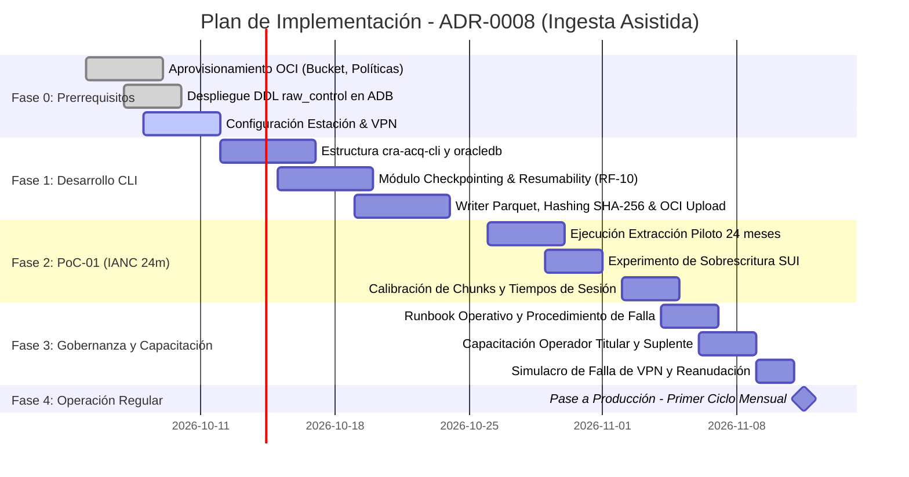

# Plan de Implementación: Motor de Adquisición en Estado Actual (ADR-0008)
**Observatorio Regulatorio CRA**  
*Modo Operativo: Ingesta Asistida por Operador vía VPN Site-to-Person*

---

## 1. Justificación, Alcance y Principios del Plan

El presente plan de implementación materializa la decisión estratégica adoptada en `ADR-0008`: **habilitar la ingesta real del SUI desde el día uno mediante una estación operada con conexión VPN site-to-person**, sin esperar los plazos inciertos de un enlace permanente site-to-site entre la CRA y la SSPD.

### Premisas No Negociables
1. **Cero SQL Improvisado (`ADR-0008` § 3):**  
   El operador jamás ejecuta consultas ad hoc para alimentar el lago. Ejecuta exclusivamente una herramienta de línea de comandos versionada (`cra-acq-cli`).
2. **Cero Credenciales Embebidas (`ADR-0008` § 6):**  
   El software no contiene contraseñas en código ni archivos de texto plano. La autenticación a Oracle SUI es interactiva en memoria, y la autenticación a OCI se realiza mediante llaves de API o sesión OCI CLI de la estación.
3. **Reanudabilidad y Segmentación (`RF-SUI-10`):**  
   Dado que las sesiones VPN expiran a las **4 horas continuas**, la ingesta opera en *chunks* con puntos de control (checkpoints). Si la sesión cae, se reanuda exactamente donde quedó sin duplicar registros.
4. **Mitigación Estricta del Bus Factor (`ADR-0008` § 5):**  
   Mínimo **dos operadores autorizados** debidamente capacitados para garantizar la continuidad del servicio de información.

---

## 2. Cronograma Maestro de Implementación (6 Semanas)

El plan se estructura en **5 fases secuenciales** con hitos de validación concretos:



---

## 3. Desglose de Actividades por Fase

### Fase 0: Aprovisionamiento y Entorno de Trabajo (Semana 1)

1. **Configuración en OCI:**
   - Crear el Bucket `cra-observatorio-raw` en OCI Object Storage (`ADR-0007`):
     - Tier: Standard con ciclo de vida a Infrequent Access a los 90 días.
     - Retention Rule: Bloqueo de borrado (WORM) por 10 años (`RNF-SUI-02`).
   - Aplicar políticas IAM en OCI para la estación de trabajo:
     ```
     Allow group GRP_OBSERVATORIO_OPERATORS to manage objects in compartment cmp-observatorio-regulatorio where target.bucket.name='cra-observatorio-raw'
     ```
2. **Despliegue del DDL de Control:**
   - Ejecutar el script DDL de `raw_control` en la Autonomous Database (ADB): tablas `ingestion_source`, `ingestion_batch`, `ingestion_checkpoint`, `raw_dataset` y `raw_change_log`.
3. **Acondicionamiento de la Estación de Extracción:**
   - Estación de trabajo designada dentro de la CRA.
   - Instalación de software base: Python 3.11+, cliente de VPN de la SSPD, OCI CLI configurado con llave RSA.
   - Validación de red: prueba de ping y `tnsping` al listener Oracle SUI una vez levantada la VPN.

---

### Fase 1: Construcción y Empaquetado del Extractor Versionado (`cra-acq-cli`) (Semanas 2 y 3)

1. **Invocación Interactiva con Autenticación en Memoria:**
   ```bash
   cra-acq run --source SUI --period 2026-08 --domain BALANCE_HIDRICO
   # El CLI solicita interactivamente:
   # [?] Usuario Oracle SUI: <USUARIO_SUI>
   # [?] Contraseña Oracle SUI: ********** (nunca se escribe a disco ni a logs)
   ```
2. **Lógica de Checkpointing y Chunking (`RF-SUI-10`):**
   - El extractor divide la consulta por bloques de prestadores (ej. 200 prestadores por chunk).
   - Al terminar un chunk, escribe el archivo `batch_XXX_chunk_YYY.parquet` en OCI e inserta el progreso en `raw_control.ingestion_checkpoint`.
   - Si la VPN se desconecta en el chunk 3, el comando `cra-acq resume --batch-id BATCH-20261015-01` lee el último checkpoint y continúa con el chunk 4.
3. **Hashing Criptográfico y Linaje (`RF-SUI-02`):**
   - Calcula el SHA-256 del archivo SQL ejecutado.
   - Calcula el SHA-256 de los bytes del resultset antes de subir a OCI.
   - Inserta el registro en `raw_control.raw_dataset` con los metadatos completos y el identificador del operador.

---

### Fase 2: Ejecución de la Prueba de Concepto Piloto — PoC-01 (Semana 4)

Ejecución del protocolo definido en `poc-01-ianc.md` para grandes prestadores sobre **24 periodos mensuales consecutivos** (2 años).

#### Objetivos del Ensayo
1. **Medición Empírica de Tiempos y Volumetría:**  
   Registrar la duración real de extracción por periodo para validar si se cumple la ventana operativa de 4 horas de la VPN.
2. **Experimento de Mutabilidad del SUI (Crítico):**  
   - Día 1: Extraer los 24 periodos y guardar los hashes SHA-256 de cada dataset.
   - Día 5: Re-extraer los mismos 24 periodos y comparar los hashes byte a byte.
   - **Resultado A (Hashes idénticos):** El SUI no mutó el histórico en esa semana.
   - **Resultado B (Hashes distintos):** Se detecta retransmisión/sobrescritura en origen. Se valida que el motor marca `superseded = 1` y preserva la versión anterior en Object Storage.
3. **Prueba de Interrupción Forzada:**  
   Cortar deliberadamente la conexión VPN en el periodo 12 y ejecutar `cra-acq resume` para certificar que no se duplican registros y la extracción se completa exitosamente.

---

### Fase 3: Gobernanza, Runbooks y Mitigación del Bus Factor (Semana 5)

1. **Designación y Capacitación de Operadores:**
   - **Operador Titular:** Profesional Especializado de Datos (Responsable primario).
   - **Operador Suplente:** Profesional de Regulación / Analista de Sistemas (Responsable de respaldo).
   - Taller de 8 horas: arquitectura del motor, manejo de VPN, comandos CLI, resolución de incidentes.
2. **Elaboración del Runbook Operativo (Manual de Procedimiento):**
   - Documento paso a paso con lista de chequeo antes, durante y después de la sesión.
   - Protocolo de escalamiento si el SUI arroja `ORA-01017` (credencial bloqueada) u `ORA-01013` (tiempo de espera agotado).
3. **Simulacro de Relevo (Handover Drill):**
   - El Operador Suplente ejecuta la extracción completa de un periodo mensual de forma autónoma, reportando las bitácoras al Curador de Datos (`ACT-CURADOR-DATOS`).

---

### Fase 4: Entrada en Operación Regular y Cadencia Sostenible (Semana 6+)

Una vez validada la PoC y entrenados los operadores, se activa la operación regular según la cadencia acordada en `ADR-0008` § 4:

| Tipo de Ejecución | Frecuencia | Ventana / Alcance | Duración Máxima Estimada | Responsable |
|---|---|---|---|---|
| **Extracción Regular** | Mensual (día 10 al 15 de cada mes) | Periodo $T-1$ (y verificación de $T-2$) | 2 a 3 horas continuas | Operador Titular |
| **Re-extracción Profunda** | Trimestral (primer día hábil del trimestre) | Ventana histórica de 12 meses ($T-3$ a $T-12$) | 2 sesiones de 3 horas en días consecutivos | Operador Titular / Suplente |
| **Ingesta de Fuentes Abiertas** | Mensual / Anual | DANE DIVIPOLA y SIVICAP (APIs públicas) | Desatendida en OCI (automática) | Sistema |

---

## 4. Runbook Operativo: Lista de Chequeo para la Sesión de Extracción

### A. Antes de Conectarse (Pre-Flight)
- [ ] Verificar que no haya mantenimiento programado en OCI ni en la plataforma SUI.
- [ ] Confirmar que la franja horaria corresponda a horario de bajo impacto (después de las 17:00 o antes de las 08:00 h).
- [ ] Verificar espacio libre en disco local ($\ge 20\text{ GB}$) para buffers temporales.
- [ ] Abrir el túnel VPN institucional con credenciales personales y autenticación de segundo factor (MFA).

### B. Durante la Extracción
- [ ] Abrir terminal segura y validar la conectividad:
  ```bash
  cra-acq ping --source SUI
  ```
- [ ] Ejecutar el paquete mensual para el dominio correspondiente:
  ```bash
  cra-acq run --source SUI --domain BALANCE_HIDRICO --period 2026-08
  ```
- [ ] Monitorear la barra de progreso de chunks. No suspender la máquina ni desconectar el cable de red.
- [ ] **En caso de corte de VPN:**
  1. Reconectar la sesión VPN.
  2. Consultar el estado: `cra-acq status --batch-id BAT-XXXX`.
  3. Reanudar: `cra-acq resume --batch-id BAT-XXXX`.

### C. Al Finalizar la Extracción (Post-Flight)
- [ ] Revisar el resumen emitido por consola:
  ```
  [✓] Batch BAT-20261015-01 completado exitosamente.
  [✓] Datasets subidos a OCI: 4 archivos Parquet (Total: 48.2 MB).
  [✓] Registros procesados: 124,530 | Anomalías PII suprimidas: 0
  [✓] Estado en raw_control: COMPLETED.
  ```
- [ ] Cerrar formalmente el túnel VPN.
- [ ] Notificar al Curador de Datos (`ACT-CURADOR-DATOS`) mediante correo o canal Teams con el ID del Batch para iniciar la conformación de indicadores.

---

## 5. Matriz de Riesgos y Acciones de Mitigación

| Riesgo Operativo | Severidad | Probabilidad | Medida de Mitigación en el Plan |
|---|---|---|---|
| **Expiración de la sesión VPN a mitad de extracción** | Alta | Alta | Arquitectura de **Chunking y Checkpointing** (`RF-SUI-10`). El operador reanuda el lote sin perder lo avanzado. |
| **Indisponibilidad del Operador Titular (Bus Factor = 1)** | Alta | Media | Regla mandatoria de **2 operadores acreditados** y simulacro de extracción trimestral con el suplente. |
| **Cambio de nombres de columnas en el SUI (Schema Drift)** | Media | Media | El **Schema Drift Detector** (`RF-SUI-06`) bloquea la conformación, guarda el crudo y emite alerta técnica. |
| **Bloqueo de la cuenta de consulta por múltiples reintentos** | Alta | Baja | Circuit Breaker en el conector Oracle: máximo 3 intentos con backoff exponencial antes de abortar. |
| **Filtro de datos personales de suscriptores** | Crítica | Baja | Sanitizador automático en memoria: remueve columnas restringidas antes de generar el archivo Parquet (`RN-SUI-04`). |

---

## 6. Criterios de Aceptación del Plan (Definition of Done)

1. **Paquete CLI Operativo:** Herramienta `cra-acq-cli` empaquetada, versionada en Git, con pruebas unitarias pasando y catálogo SQL integrado.
2. **Almacenamiento OCI Configurado:** Bucket inmutable `cra-observatorio-raw` recibiendo archivos Parquet con metadatos de cabecera correctos.
3. **Control en ADB Operativo:** Esquema `raw_control` poblado y reflejando fielmente lotes, datasets y checkpoints sin intervención manual en SQL.
4. **PoC-01 Validada:** Serie de 24 periodos de IANC extraída, con reporte técnico sobre el comportamiento de mutabilidad en el SUI.
5. **Mitigación del Bus Factor Certificada:** Dos funcionarios capacitados, con credenciales válidas y habiendo ejecutado al menos una extracción exitosa cada uno.
6. **Runbook Aprobado:** Procedimiento operativo documentado en el Context Lake y avalado por la Subdirección de Regulación de la CRA.
