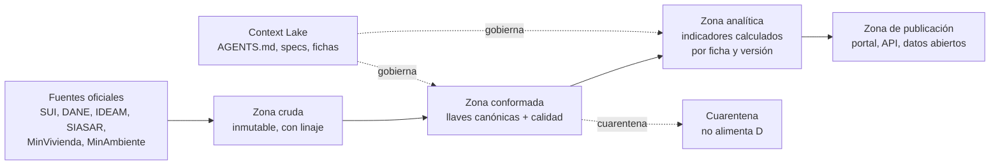

# Arquitectura — Observatorio Regulatorio CRA

> **El stack todavía NO está decidido.** Este archivo define el **contrato lógico** que cualquier implementación debe respetar, no la tecnología. Un agente **NO DEBE** asumir motor de base de datos, orquestador ni framework a partir de este documento. Ver `Q-ARQ-01`.

## Vista general

Cinco zonas, con una frontera dura entre la zona cruda y todo lo demás: nada se transforma antes de quedar registrado tal como llegó.

## Componentes

| Componente | Responsabilidad | Tecnología | Depende de |
|---|---|---|---|
| Ingestor | Descargar de cada fuente, registrar linaje, escribir en zona cruda sin transformar | por decidir | Disponibilidad de la fuente |
| Zona cruda | Conservar el archivo original, inmutable, versionado por fecha de descarga | almacenamiento de objetos | — |
| Conformador | Aplicar llaves canónicas, tipos y reglas de validación; asignar semáforo | por decidir | Zona cruda; `specs/calidad-de-datos.md` |
| Motor de indicadores | Ejecutar la fórmula de cada ficha, por versión, sobre datos conformados | por decidir | `specs/ontologia-indicadores.md` |
| Motor analítico | DEA/SFA, agrupamiento, NLP de observaciones | por decidir | Zona analítica |
| Portal y API | Exponer tableros, descargas y API pública | por decidir | Zona de publicación |
| Catálogo de metadatos | Registrar fichas, versiones, linaje y diccionario de datos | por decidir | Todas |

## Modelo de datos

Entidades mínimas del núcleo. Los nombres son canónicos y en inglés para código; su equivalente de negocio está en `docs/glosario.md`.

| Entidad | Llave | Descripción |
|---|---|---|
| `provider` | `provider_id` (ID SUI) | Prestador. Atributos: NIT, naturaleza jurídica, segmento, servicios prestados |
| `service_area` | `service_area_id` | APS. Relaciona prestador con municipios (DIVIPOLA) y zona urbana/rural |
| `municipality` | `divipola_code` | Municipio DANE. Llave territorial única de todo el sistema |
| `reporting_period` | `period_id` | Periodo de reporte (AAAA-MM o AAAA). Distinto de la fecha de carga |
| `raw_record` | `raw_record_id` | Registro crudo con `source`, `form_id`, `period_id`, `download_ts`, `file_hash` |
| `indicator_definition` | `indicator_code` + `version` | Ficha metodológica versionada |
| `indicator_value` | `indicator_code` + `version` + `provider_id` + `service_area_id` + `period_id` | Valor calculado, con `quality_flag` y `status` |
| `quality_finding` | `finding_id` | Resultado de una regla de validación sobre un registro o un valor |
| `citizen_observation` | `observation_id` | Observación anonimizada a un proyecto regulatorio |

**Reglas del modelo, no negociables:**

1. `divipola_code` es la **única** llave territorial. Nombres de municipio jamás se usan como llave: cambian y se repiten entre departamentos.
2. `indicator_value` **NO DEBE** existir sin su `indicator_definition` en la versión con que se calculó. Recalcular con fórmula nueva crea filas nuevas, no actualiza las viejas.
3. La zona cruda es **append-only**. Una retransmisión del prestador crea un `raw_record` nuevo; no reemplaza el anterior.
4. Toda tabla con series temporales lleva `period_id` **y** `download_ts`. Confundirlos produce revisiones históricas invisibles.

## Integraciones externas

| Sistema | Protocolo | Autenticación | Qué pasa si está caído |
|---|---|---|---|
| SUI (SSPD) | por definir (API REST o descarga masiva) | por definir | El periodo no se cierra; se reintenta y se notifica al curador. **Nunca** se publica el periodo incompleto |
| DANE | descarga de catálogo | pública | Se usa la última versión vigente, declarando la fecha de corte en el portal |
| IDEAM / SIRH | catálogo abierto | pública | Los indicadores dependientes quedan en semáforo amarillo con nota de desactualización |
| SIASAR | por definir | por definir | Igual que IDEAM |
| MinVivienda / MinAmbiente | por definir | por definir | Igual que IDEAM |
| Gestor Normativo CRA | enlace | pública | Las fichas siguen citando la norma por número; el enlace se degrada a texto |

> **ASUNCIÓN (sin validar):** El acceso sistemático al SUI requiere acuerdo formal con la SSPD que hoy no consta. Origen: no aparece en el material. Bloquea RF-SUI-01. Ver `Q-GOB-02`.

## Convenciones de código

- Identificadores de código, tablas y columnas en **inglés**, `snake_case`. Todo lo visible al usuario en **español (Colombia)**.
- Fechas en ISO 8601; almacenamiento en UTC; presentación en hora de Colombia.
- Cifras monetarias en pesos colombianos, enteros, con el año base y la condición (corriente o constante) como columnas explícitas, nunca implícitas en el nombre.
- Prohibido el `SELECT` sobre la zona cruda desde el portal: la publicación solo lee la zona de publicación. Razón: evita que un dato en cuarentena llegue al público por una consulta directa.
- Prohibido imputar valores faltantes en el pipeline sin dejar la marca correspondiente. Razón: `specs/calidad-de-datos.md` RN-CAL-03.
- Todo cálculo publicado DEBE ser reproducible desde `(indicator_code, version, period_id, snapshot de datos)`.

## Deuda técnica conocida

| Dónde | Qué | Impacto para un agente que toque esta zona |
|---|---|---|
| Stack completo | Sin decidir | No escribir infraestructura como código todavía; primero cerrar `Q-ARQ-01` |
| Diccionario de datos del SUI | Existe un trabajo previo de la CRA de modelo de datos regulatorio a partir del diccionario de variables del SUI | Reutilizarlo antes de redefinir variables desde cero; evitar duplicar la ontología |
| Carpeta `04_` en Drive | Vacía | El modelo conceptual y lógico detallado no existe aún; este archivo es el único contrato vigente |

## Preguntas abiertas

| ID | Pregunta | Bloquea | Responsable |
|---|---|---|---|
| Q-ARQ-01 | ¿Qué servicios de OCI y qué motor analítico se adoptan? | Todos los componentes | CIO |
| Q-ARQ-02 | ¿El portal público se despliega en la sede electrónica de la CRA o como dominio propio? Afecta accesibilidad y analítica | `specs/portal-publico.md` | CIO |
| Q-ARQ-03 | ¿Qué retención se exige para la zona cruda? Las series tarifarias son quinquenales, lo que sugiere mínimo 10 años | Dimensionamiento de almacenamiento | CIO |
| Q-ARQ-04 | ¿Se reutiliza el modelo de datos del proyecto Diccionario de Datos SUI de la CRA como base del conformador? | Componente Conformador | CIO |

## Historial

| Fecha | Cambio | Origen |
|---|---|---|
| 2026-09-13 | Versión inicial como contrato lógico, sin stack | Sesión de generación |
