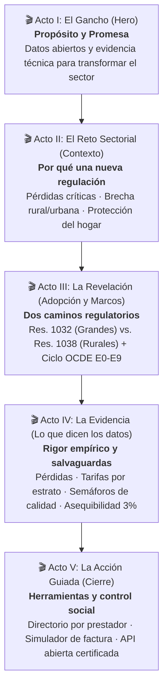

# 📋 Blueprint Narrativo: Observatorio Regulatorio CRA
## Seguimiento Integral a los Nuevos Marcos Tarifarios (Resoluciones CRA 1032 y 1038 de 2026)

---

## 1. Ficha del Propósito Estratégico

- **Nombre de la Plataforma:** Observatorio Regulatorio de Agua Potable y Saneamiento Básico — CRA (República de Colombia).
- **Propósito Medular:** Democratizar el acceso a evidencia técnica verificable sobre la adopción e impacto de los Nuevos Marcos Tarifarios (NMT), garantizando la transparencia pública, la protección del bolsillo de los hogares (asequibilidad <3% OCDE), el incentivo a la reducción de pérdidas de agua y el reconocimiento de la gestión comunitaria del agua, sin incurrir en rankings discriminatorios ni promedios ciegos.
- **Audiencias Clave:**
  - *Primaria:* Comisionados de la CRA, directores de política pública, reguladores (SSPD, DNP, MinVivienda) que requieren monitoreo ex-ante y ex-post con trazabilidad de vacíos (Q-NMT) y referentes AIR de la OCDE.
  - *Secundaria Técnica:* Empresas de acueducto y alcantarillado (>5.000 suscriptores) y gestores comunitarios y rurales (hasta 5.000 suscriptores) que necesitan consultar sus metas adaptativas de nivel de servicio (IDH/IRD), incentivos por eficiencia (ISE CRA) y plazos del calendario 2026–2036.
  - *Secundaria Ciudadana:* Veedurías ciudadanas, vocales de control y usuarios que buscan conocer el impacto real en la factura por estrato, la calidad y continuidad del agua en su municipio y el esfuerzo económico de su hogar.
- **Arco Narrativo Seleccionado:** **Arco Analítico / Observatorio (*Data-to-Action Arc*)**.
- **Mensaje Clave en 1 Línea:** *"El pulso real de los servicios públicos en Colombia: datos verificables para que el agua y el saneamiento transformen vidas con justicia tarifaria y rigor técnico."*

---

## 2. Auditoría Estructural y Diagnóstico: Antes vs. Después

### Scorecard de Auditoría Narrativa (Checklist de 1 a 25)

| Dimensión | Puntuación | Hallazgo en el Estado Previo | Oportunidad de Mejora Implementada |
| :--- | :---: | :--- | :--- |
| **1. Hero & Propósito** | **4 / 5** | Titular correcto pero pasivo (*"Datos abiertos para que el agua..."*); no explicaba de inmediato la trascendencia de la transición 2026. | Titular con verbo rector de transformación y subtítulo que posiciona la dualidad urbana/rural y la justicia tarifaria. Botones con rol definido. |
| **2. Flujo y Ritmo Escénico** | **3 / 5** | *Salto abrupto*: Del Hero se pasaba directamente a un anillo de adopción del 64% sin explicar *por qué* Colombia expidió estos marcos ni qué problemas resuelven. | **Incorporación del Acto II (El Reto Sectorial)**: 3 tarjetas que explican la crisis de pérdidas, la asimetría rural/urbana y la asequibilidad de los hogares antes de mostrar los datos. |
| **3. Evidencia y Datos** | **4.5 / 5** | Excelente motor analítico y salvaguardas (ADR-0003, ADR-0005), pero las tarjetas KPI carecían de micro-historias que contextualizaran el *insight*. | Integración de micro-narrativas en cada KPI (`kpi-insight`), destacando qué significa el dato para la ciudadanía y la meta sectorial. |
| **4. Copywriting & Tono** | **3.5 / 5** | Textos predominantemente descriptivos y técnicos (*"Estudios de costos radicados"*, *"Pérdidas de agua"*). | Titulares con pulso activo: *"El pulso de la transición"*, *"La eficiencia en juego: brecha de pérdidas"*, *"Justicia y focalización estrato por estrato"*. |
| **5. Cierre & Salida Guiada** | **4 / 5** | Recursos y pie de página funcionales pero sin rutas diferenciadas por rol de usuario. | CTAs contextualizados: ruta rápida para ciudadanos (simulador y buscador), analistas (AIR y API) y prestadores (fichas y calendario). |
| **PUNTUACIÓN TOTAL** | **19 / 25** | **Diagnóstico:** Portal robusto técnicamente, listo para dar el salto a una experiencia de comunicación pública y liderazgo regulatorio de estándar internacional. | **Meta Post-Optimización: 24 / 25.** |

---

## 3. Arquitectura Escénica Propuesta en 5 Actos

### 🎬 Acto I: El Gancho y la Premisa (Hero Section)
- **H1:** `Datos abiertos y evidencia técnica para que el agua y el saneamiento lleguen a todos`
- **Subtítulo (Lede):** `Monitoreamos la transición hacia los Nuevos Marcos Tarifarios 2026: rigor analítico para las grandes ciudades y equidad adaptativa para las comunidades rurales, sin rankings engañosos ni promedios ciegos.`
- **Acciones Directas:**
  - `[Explorar indicadores 2026]` → Lleva a Grandes Prestadores (`#tablero`).
  - `[Acueductos rurales (Res. 1038)]` → Lleva a Pequeños Prestadores (`#nmtpp`).
  - `[Buscar mi prestador]` → Lleva al Directorio individual (`#prestadores`).
- **Métricas Ancla:** 188 grandes prestadores (Res. 1032) · 40 pequeños y comunitarios (Res. 1038) · Cobertura en departamentos.

### 🎬 Acto II: El Reto y la Oportunidad del Sector (Contexto Necesario)
- **Título:** `El reto del sector: por qué una nueva regulación del agua en Colombia`
- **Subtítulo:** `Comprender los desafíos estructurales que motivaron los marcos tarifarios de 2026 es el primer paso para evaluar su impacto.`
- **Pilares Narrativos (3 Tarjetas Bento):**
  1. **La brecha de pérdidas de agua:** Cientos de municipios pierden más de 6 m³ de agua tratada por suscriptor al mes. El nuevo marco impone incentivos para renovar redes sin trasladar ineficiencias a la tarifa.
  2. **Diferenciación histórica rural y urbana:** No se puede medir con la misma regla a una metrópoli de un millón de usuarios que a un acueducto comunitario de 200 familias. La Res. 1038 crea metas adaptativas y trato especial a zonas PDET e insulares.
  3. **Asequibilidad y protección del hogar:** La tarifa debe ser económicamente sostenible pero socialmente justa. Se monitorea que el pago del servicio no supere el umbral internacional de referencia del 3% del ingreso familiar (OCDE/Banco Mundial), apalancado en los subsidios de la Ley 142 de 1994.

### 🎬 Acto III: La Revelación y la Arquitectura Dual (Adopción y Ciclo)
- **Cifras Clave:**
  - `El pulso de la transición: estudios de costos radicados` (Anillo interactivo diferenciando grandes prestadores de la Res. 1032 y pequeños acueductos de la Res. 1038).
  - `Dos realidades territoriales, dos marcos que nunca se mezclan ni se suman` (Regla de oro 10).
  - `Alcance social:` Millones de suscriptores urbanos atendidos con trazabilidad de costos.
- **Ciclo Regulatorio E0–E9:**
  - Visualización del anillo con las 10 etapas del estándar de política regulatoria de la OCDE, destacando la etapa E5 en curso (Estudios de Costos y Facturación Plena).

### 🎬 Acto IV: La Evidencia y Micro-Historias (Lo que Revelan los Datos)
- **Pérdidas de Agua:** *"La eficiencia en juego: prestadores que superan el umbral de referencia"* + Comparador visual de distribución y enlace a la ficha NMT-EST-02.
- **Tarifas por Estrato:** *"Justicia y focalización: la variación se evalúa estrato por estrato (E1 a E6), nunca como una tarifa promedio general"* + Gráfico de barras comparativo.
- **Calidad del Dato:** *"Rigor y compuerta activa: semáforos visibles (Verificado, Observado, En Cuarentena, No Reportó)"* para leer cada cifra con la debida cautela analítica.
- **Páginas Temáticas:** Exploración guiada hacia Asequibilidad del Hogar, Radar de los 12 Principios de Gobernanza de la OCDE y Mapa Georreferenciado.

### 🎬 Acto V: La Acción y el Empoderamiento (Próximos Pasos)
- **Para la Ciudadanía:** Buscador directo de acueducto municipal con ficha individual y semáforo de objeciones.
- **Para el Analista CRA y Regulador:** Dictamen ejecutivo AIR ex-post imprimible, matriz de 5 dimensiones y descarga de datasets en CSV/JSON con linaje de fuentes (SUI Oracle / SURICATA / INS).
- **Para los Prestadores:** Guía de 25 fichas metodológicas y calendario interactivo de hitos 2026–2036.

---

## 4. Guía de Copywriting y Micro-Historias por Componente

### 1. Tarjetas KPI de Grandes Prestadores (`kpi_cards.js`)
Cada indicador incorpora un bloque `.kpi-insight` que aporta contexto interpretativo inmediato:
- **NMT-ADO-01 (Adopción):** `Mediana de radicación activa: prestadores en ruta hacia costos eficientes auditados en SURICATA.`
- **NMT-ADO-02 (Oportunidad):** `Velocidad de respuesta regulatoria: días transcurridos desde la expedición hasta la primera factura.`
- **NMT-TAR-01 (Tarifas E3):** `Focalización sin sesgos: variación en estrato 3 en pesos constantes de 2024 con subsidio aplicado.`
- **NMT-LB-01 (Línea Base):** `Alistamiento informativo para el cierre definitivo de cuentas regulatorias del quinquenio 2026.`
- **NMT-EST-01 (Continuidad IDH2):** `Garantía de suministro: prestadores que cumplen o superan la meta de horas continuas por día.`
- **NMT-EST-02 (Brecha IPUF):** `Control a pérdidas: brecha frente a la meta de 6 m³/susc/mes que orienta planes de inversión.`
- **NMT-INC-01 (Incentivos/Descuentos):** `Protección al usuario: compensaciones aplicables por fallas o rezagos en calidad del servicio.`
- **NMT-RIE-01 (Riesgo IUS):** `Monitoreo preventivo SSPD: operadores en observación prioritaria para salvaguardar la viabilidad.`

### 2. Encabezados de Páginas Internas (`app.js` - `pageMeta`)
- **Grandes Prestadores:** *"Grandes prestadores urbanos: eficiencia y tarifas justas"* — Seguimiento riguroso a costos eficientes, estándares de servicio y variación tarifaria en prestadores de más de 5.000 suscriptores.
- **Pequeños Prestadores:** *"Equidad territorial en agua potable: pequeñas poblaciones y zonas rurales"* — Metas adaptativas de continuidad, calidad y micromedición diseñadas a la medida de la escala y realidad comunitaria.
- **Impacto Regulatorio:** *"Impacto, asequibilidad social y gobernanza del agua"* — Cinco dimensiones de impacto, simulador del esfuerzo en la factura del hogar (umbral 3 % OCDE) y evaluación del ciclo E0 a E9.
- **Directorio:** *"Directorio universal auditable: conozca a su prestador"* — Consulte la radiografía individual de cada operador: estado de adopción, estructura tarifaria por estrato y compuerta de calidad.
- **Mapa:** *"Presencia territorial y avance en cada departamento"* — Visualice la distribución geográfica de los prestadores monitoreados y su estado de radicación a lo largo del país.
- **Metodología:** *"Compuerta de calidad: ninguna cifra sin evidencia"* — Todo indicador cuenta con ficha técnica pública, fórmula canónica, sustento normativo explícito y semáforo de verificación.
- **Datos Abiertos:** *"Datos abiertos certificados e interoperabilidad API"* — Descargue series de microdatos con trazabilidad de linaje (SUI Oracle / SURICATA) para investigación, auditoría y control social.

---

## 5. Salvaguardas Regulatorias Preservadas (Invariantes)
1. **RN-PORTAL-05 / RN-NMT-01:** Cero rankings o puntajes compuestos que califiquen de "mejor a peor".
2. **RN-PORTAL-04 / RN-NMT-03:** Prohibición absoluta de promedios tarifarios; la variación se publica exclusivamente desagregada por estrato (1 al 6) y clase de uso.
3. **RN-NMT-02:** No comparabilidad inter-segmentos; las comparaciones se limitan a pares dentro del mismo segmento.
4. **INV-01 / RN-NMTPP-05:** Aviso prominente de datos sintéticos en todo el componente de la Res. 1038 y leyenda de seguimiento informativo sin efecto jurídico.
5. **Ciclo OCDE:** Mantenimiento estricto de las 10 etapas (E0 a E9) con trazabilidad de vacíos Q-NMT-01 y Q-NMT-02.
